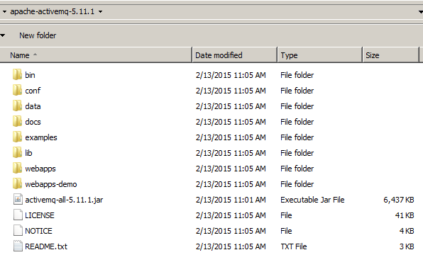
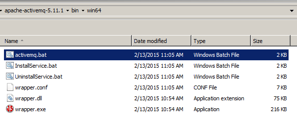
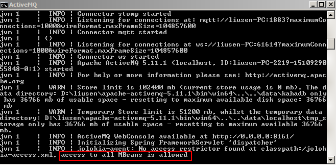
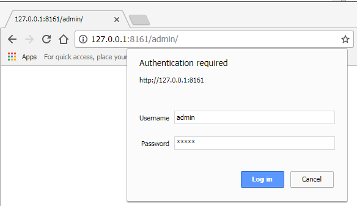
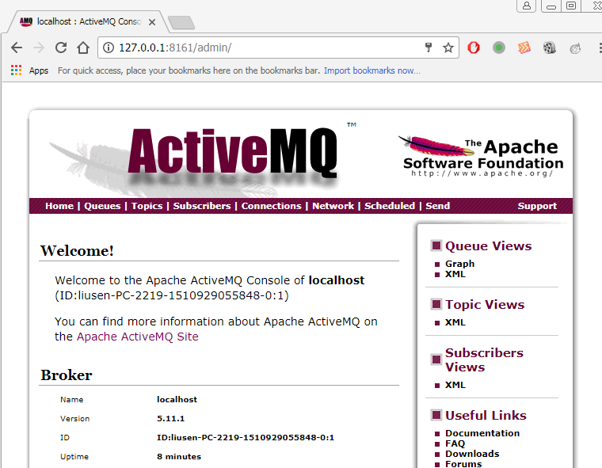
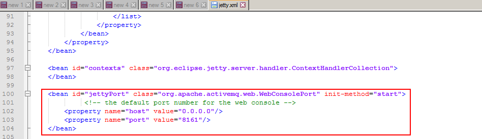
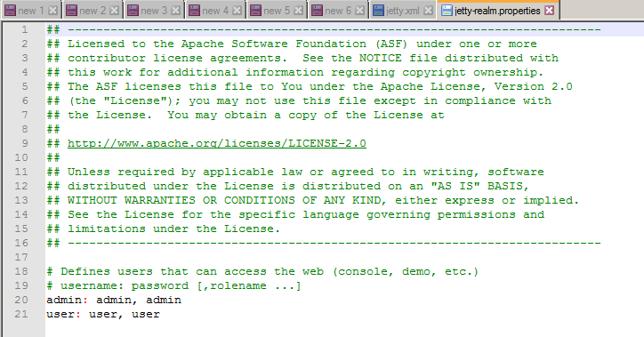
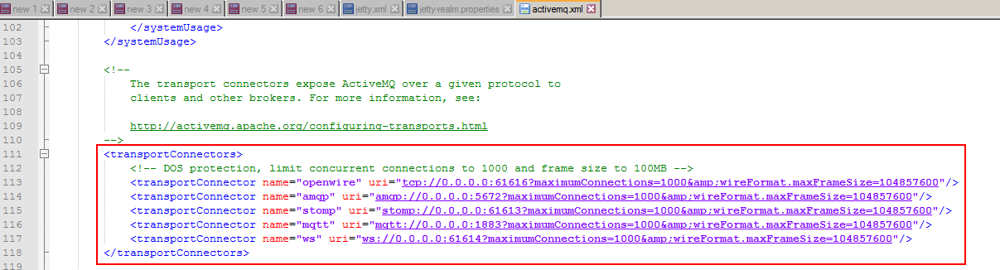

1、JMS
2、ActiveMQ初步
3、ActiveMQ详细使用
4、高级主题（两种经典的消息模式、与Spring整合、集群、监控、配置优化等等）

1.1、背景 & JMS
当前CORBA、DCOM、RMI等RPC中间件技术已广泛应用于各个领域。但是面对规模和复杂度都越来越高的分布式系统，这些技术也显示出其局限性：

（1）同步通信：客户发出调用后，必须等待服务对象完成处理并返回结果后才能继续执行；

（2）客户和服务对象的生命周期紧密耦合：客户进程和服务对象进程都必须正常运行；如果由于服务对象崩溃或者网络故障导致客户的请求不可达，客户会收到异常。

（3）点对点通信：客户的一次调用只发给某个单独的目标对象。

面向消息的中间件（Message Oriented Middleware, MOM)较好的解决了以上问题。发送者将消息发送给消息服务器，消息服务器将消息存放在若干队列中，在合适的时候再将消息转发给接收者。这种模式下，发送和接收是异步的，发送者无需等待；二者的生命周期未必相同：发送消息的时候接收者不一定运行，接收消息的时候发送者也不一定运行；一对多通信：对于一个消息可以有多个接收者。

JAVA消息服务（JMS）定义了Java中访问消息中间件的接口。JMS只是接口，并没有给予实现，实现JMS接口的消息中间件称为JMS Provider，已有的MOM系统包括Apache的ActiveMQ、以及阿里的RocketMQ、IBM的MQSeries、Microsoft的MSMQ和BEA的MessageQ、RabbitMQ等……他们基本都遵循JMS规范。

1.2、JMS术语

JMS：实现JMS接口的消息中间件
Provider(Message Provider)：生产者
Consumer(Message Consumer)：消费者
PTP: Point to Point，即点对点的消息模式
Pub/Sub：Publish/Subscribe，即发布/订阅的消息模型

Queue：队列目标。注意：Queue和PTP是一对概念。
Topic：主题目标。注意：Topic和Pub/Sub是一对概念。

ConnectionFactory：连接工厂，JMS用它创建连接
Connection：JMS客户端到JMS Provider的连接
Destination：消息的目的地
Session：会话，一个发送或接收消息的线程

1.3、JMS术语概念

ConnectionFactory接口（连接工厂）

用户用来创建到JMS提供者的连接的被管对象。JMS客户通过可移植的接口访问连接，这样当下层的实现改名时，代码不需要进行修改。管理员在JNDI名字空间中配置连接工厂，这样，JMS客户才能查找到它们。根据消息类型的不同，用户将使用队列连接工厂，或者主题工厂。

Connetion接口（连接）

连接代表应用程序和消息服务器之间通信链路。在获得了连接工厂后，就可以创建一个与JMS提供者的连接。根据不同的连接类型，连接允许用户创建会话，以发送和接收队列和主题到目标。

Destination接口（目标）

目标是一个包装了消息目标标识符的被管对象，消息目标是指消息发布和接收地点，或者是队列，或者是主题。JMS管理员创建这些对象，然后用户通过JNDI发现他们。和连接工厂一样，管理员可以创建两种类型的目标，点对点模型的队列，以及发布者/订阅者模型的主题。

MessageConsumer接口（消息消费者）

由会话创建的对象，用于接收发送到目标的消息。消费者可以同步地（阻塞模式）或异步（非阻塞）接收队列和主题类型的消息。

MessageProducer接口（消息生产者）

由会话创建的对象，用于发送消息到目标。用户可以创建某个目标的发送者，也可以创建一个通用的发送者，在发送目标时指定目标。

Message接口（消息）

是在消费者和生产者之间对象，也就是从一个应用程序发送到另一个应用程序。一个消息有3个主要部分：
（1）消息头（必须）：包含用于识别和为消息寻找路由的操作设置
（2）一组消息属性（可选）：包含额外的属性，支持其他提供者和用户的兼容。可以创建定制的字段和过滤器（消息选择器）。
（3）一个消息体（可选）：允许用户创建五种类型的消息（文本消息、映射消息，字节消息、流消息和对象消息）。

消息接口非常灵活，并提供了许多方式来定制消息内容。

Session接口（会话）

表示一个单线程的上下文，用于发送和接收消息。由于会话是单线程的，所以消息是连续的，就是说消息是按照发送的顺序一个一个接收。会话的好处是它支持事务。如果用户选择了事务支持，会话上下文将保存一组消息，直到事务被提交才发送这些消息。在提交事务之前，用户可以使用回滚操作取消这些消息。一个会话允许用户创建消息生产者来发送消息，创建消息消费者来接收消息。

1.6、消息格式定义

JMS定义了5种不同的消息正文格式，以及调用的消息类型，允许你发送并接收一些不同形式的数据，提供现有消息格式的一些级别的兼容性。

StreamMessage Java 原始值的数据流
MapMessage 一套名称－值对
TextMessage 一个字符串对象
ObjectMessage 一个序列化的Java对象
BytesMessage 一个未解释字节的数据流

2.1、ActiveMQ简介

ActiveMQ是Apache出品，最流行的，能力强劲的开源消息总线。
ActiveMQ是一个完全支持JMS1.1和J2EE 1.4规范的JMS Provider实现，尽管JMS规范出台已经是很久的事情了，但是JMS在当今的J2EE应用中间件仍然扮演着特殊的地位，可以说ActiveMQ在业界应用最广泛。当然如果想要有更强大的性能和海量数据处理能力，ActiveMQ还需要不断的升级版本，80%以上的业务我们使用ActiveMQ足够满足需求，当然后续如天猫、淘宝网这种大型电商网站，尤其是双11这种特殊时间，ActiveMQ需要进行很复杂的优化源码以及架构设计才能完成，我们之后会学习一个更强大的分布式消息中间件，RocketMQ，可以说ActiveMQ是核心，是基础，所以我们必须要掌握好。

2.2、ActiveMQ使用

去官方网站下载： http://activemq.apache.org/ 我们下载最新的：apache-activemq-5.11.1-bin.zip，我们学习ActiveMQ暂时使用的是window系统，后期学习RocketMQ的时候使用的是Linux系统。

下载好进行解压缩，目录如下：

执行apache-activemq-5.11.1\bin\win64目录下的

查看输出界面

通过浏览器访问
Open the administrative interface
URL: http://127.0.0.1:8161/admin/
Login: admin
Passwort: admin
Navigate to "Queues"
Add a queue name and click create
Send test message by klicking on "Send to"

如果想修改8161端口，可以修改apache-activemq-5.11.1\conf目录下的jetty.xml

如果想查看用户名和密码，可以查看apache-activemq-5.11.1\conf目录下的jetty-realm.properties

2.3、ActiveMQ HelloWorld

首先写一个简单的HelloWorld示例来感受一下ActiveMQ，我们需要实现接收者和发送者两部分代码的编写。

Sender/Receiver:

第1步：建立**ConnectionFactory**工厂对象，需要填入用户名、密码、以及要连接的地址，均使用默认即可，默认端口为： tcp://localhost:61616

第2步：通过**ConnectionFactory**工厂对象创建一个**Connection**连接，并且调用Connection的start方法开启连接，Connection默认是关闭的。

第3步：通过Connection对象创建**Session**会话（上下文环境对象），用于接收消息，参数配置1为是否启用事务，参数配置2为签收模式，一般我们设置自动签收。

第4步：通过Session创建Destination对象，指的是一个客户端用来指定生产消息目标和消费信息来源的对象，**在PTP模式中，Destination被称作Queue即队列；在Pub/Sub模式，Destination被称作Topic，即主题**。在程序中，可以使用多个Queue和Topic。

第5步：我们需要通过Session对象创建消息的发送和接收对象（生产者和消费者）**MessageProducer/MessageConsumer**。

第6步：我们可以使用MessageProducer的**setDeliverMode**方法为其设置持久化特性和非持久化特性（DeliveryMode）

第7步：最后我们使用JMS规范的**TextMessage**形式创建数据（通过Session对象），并用MessageProducer的send方法发送数据。同理，客户端使用receive方法进行接收数据，最后不要忘记关闭**Connection**连接。

tcp://localhost:61616

要知道为什么是61616端口，可以查看apache-activemq-5.11.1\conf目录下的activemq.xml

