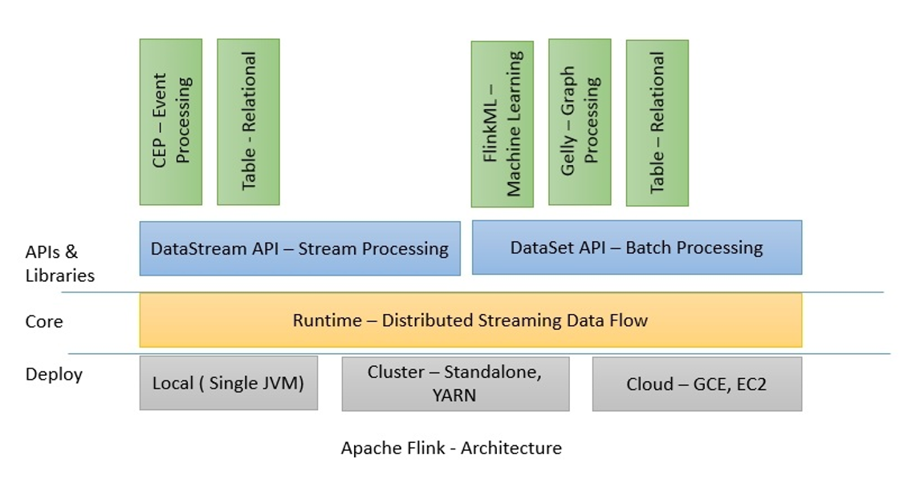

# Architecture

Flink has a layered architecture where each component is a part of a specific layer. Each layer is built on top of the others for clear abstraction. 

- **Deploy Layer**: Flink is designed to run on local machines, in a YARN cluster, or on the cloud. 
- **Core Layer**: **Runtime** is Flink's core data processing engine that receives the program through APIs in the form of JobGraph. **JobGraph** is a simple parallel data flow with a set of tasks that produce and consume data streams.

> Runtime = Flink's core data processing engine  
> Runtime处理的对象就是JobGraph，而JobGraph是通过调用API来生成的。

- **APIs & Library Layer**: The DataStream and DataSet APIs are the interfaces programmers can use for defining the Job. JobGraphs are generated by these APIs when the programs are compiled. Once compiled, the DataSet API allows the optimizer to generate the optimal execution plan while DataStream API uses a stream build for efficient execution plans.

> API -> 处理（compiled） -> JobGraphs -> 处理（optimize） -> optimized JobGraph

The **optimized JobGraph** is then submitted to the **executors** according to the deployment model. You can choose a local, remote, or YARN mode of deployment. If you have a Hadoop cluster already running, it is always better to use a YARN mode of deployment.

> optimized JobGraph -> executors

