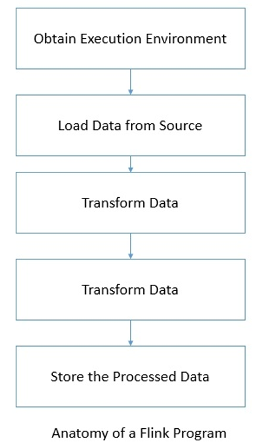

# Data Processing Using the DataStream API

Any Flink program works on a certain defined anatomy as follows:

# Execution environment

In order to start writing a Flink program, we first need to **get an existing execution environment** or **create one**. Depending upon what you are trying to do, Flink supports:

- Getting an already existing Flink environment
- Creating a local environment
- Creating a remote environment

Typically, you only need to use `getExecutionEnvironment()`. This will do the right thing based on your context. If you are executing on a local environment in an IDE then it will start a local execution environment. Otherwise, if you are executing the JAR then the Flink cluster manager will execute the program in a distributed manner.

If you want to create a local or remote environment on your own then you can also choose do so by using methods such as `createLocalEnvironment()` and
`createRemoteEnvironment(String host, int port, String... jarFiles)`.

