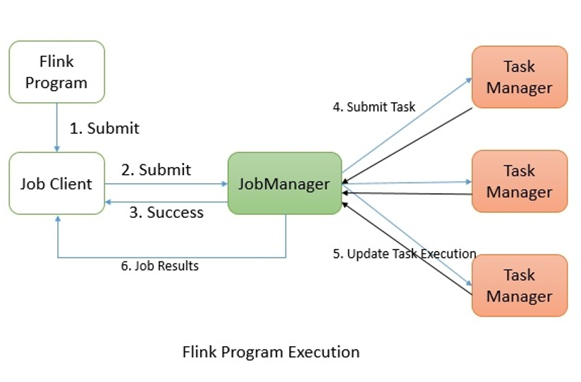
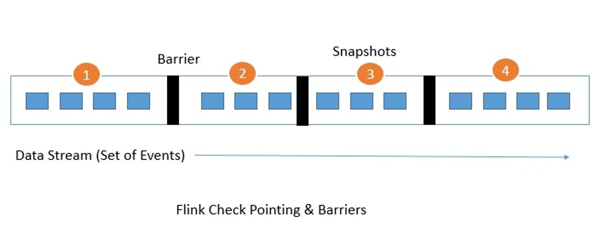
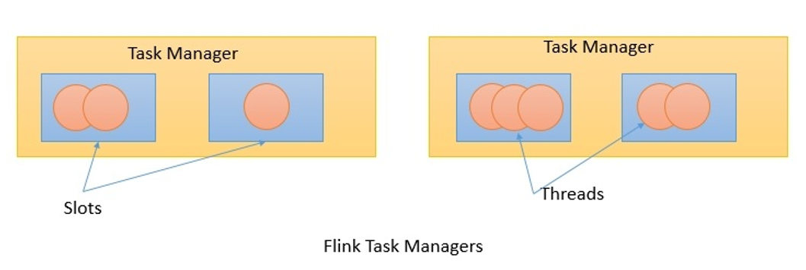
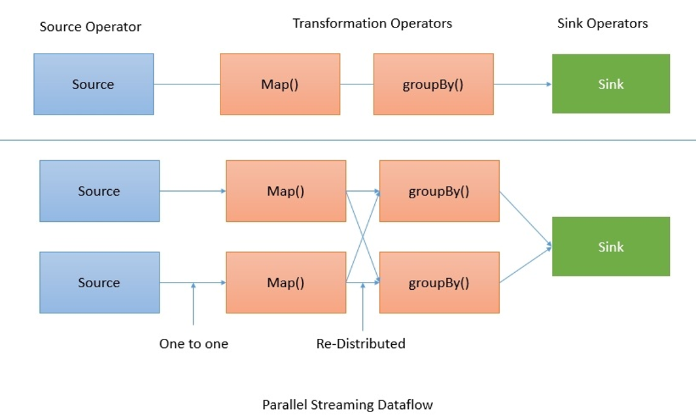

# Distributed execution

Flink's distributed execution consists of two important processes, **master** and **worker**. 

> The **Job Managers** is **master** processes.  
> **Task managers** are **worker** nodes

When a Flink program is executed, various processes(进程) take part in the execution, namely **Job Manager**, **Task Manager**, and **Job Client**.

The following diagram shows the Flink program execution:



The Flink program needs to be submitted to a **Job Client**. The **Job Client** then submits the job to the **Job Manager**. It's the **Job Manager**'s responsibility to orchestrate(精心安排；编配管弦乐曲) the resource allocation and job execution. The very first thing it does is allocate the required resources. Once the resource allocation is done, the task is submitted to the respective the **Task Manager**. On receiving the task, the **Task Manager** initiates a thread to start the execution. While the execution is in place, the **Task Managers** keep on reporting the change of states to the **Job Manager**. There can be various states such as starting the execution, in progress, or finished. Once the job execution is complete, the results are sent back to the client.

# 1. Job Manager

The **master** processes, also known as **Job Managers**, coordinate and manage the execution of the program. Their main responsibilities include scheduling tasks, managing checkpoints, failure recovery, and so on.

> Flink's distributed execution consists of two important processes, **master** and **worker**.   
> The **Job Managers** is **master** processes.  
> **Task managers** are **worker** nodes

There can be many Masters running in parallel and sharing these responsibilities. This helps in achieving high availability. One of the masters needs to be the leader. If the leader node goes down, the master node (standby) will be elected as leader.

The **Job Manager** consists of the following important components:
- Actor system
- Scheduler
- Check pointing

Flink internally uses the **Akka** actor system for communication between the **Job Managers** and
the **Task Managers**.

> 如此说来，actor system是一个通信系统。

## 1.1 Actor system

An actor system is a container of actors with various roles. It provides services such as scheduling, configuration, logging, and so on. It also contains a thread pool from where all actors are initiated. 

> An actor system is a container of actors with various roles.

All actors reside in a hierarchy. Each newly created actor would be assigned to a parent. 

> All actors reside in a hierarchy.

Actors talk to each other using a messaging system. Each actor has its own mailbox from where it reads all the messages. If the actors are local, the messages are shared through shared memory but if the actors are remote then messages are passed thought RPC calls.

> Actors talk to each other using a messaging system.

In Flink, **an actor** is **a container** having **state** and **behavior**. An actor's thread sequentially keeps on processing the messages it will receive in its mailbox. The state and the behavior are determined by the message it has received.

> In Flink, an actor is a container having state and behavior.

## 1.2 Scheduler

**Executors** in Flink are defined as **task slots**. Each **Task Manager** needs to manage one or more **task slots**. Internally, Flink decides which tasks needs to share the slot and which tasks must be placed into a specific slot. It defines that through the `SlotSharingGroup` and `CoLocationGroup`.

## 1.3 Check pointing

**Check pointing** is Flink's backbone(脊骨；主干) for providing **consistent fault tolerance**. It keeps on taking consistent snapshots for **distributed data streams** and **executor** states.

**The fault-tolerant mechanism** keeps on creating **lightweight snapshots** for **the data flows**. They therefore continue the functionality without any significant over-burden. Generally the state of the data flow is kept in a configured place such as HDFS.

**Stream barriers** are core elements of **Flink's snapshots**. They are ingested into data streams without affecting the flow. Barriers never overtake the records. They group sets of records into a snapshot. Each barrier carries a unique ID. The following diagram shows how the barriers are injected into the data stream for snapshots:



**Each snapshot state** is reported to the Flink **Job Manager**'s checkpoint coordinator. While drawing snapshots, Flink handles the alignment of records in order to avoid re-processing the same records because of any failure. This alignment generally takes some milliseconds. 

But for some intense applications, where even millisecond latency is not acceptable, we have an option to choose low latency over exactly a single record processing. 

By default, Flink processes each record exactly once. If any application needs low latency and is fine with at least a single delivery, we can switch off that trigger. This will skip the alignment and will improve the latency.


# 2. Task manager

**Task managers** are **worker** nodes that execute the tasks in one or more threads in JVM.

> Flink's distributed execution consists of two important processes, **master** and **worker**.   
> The **Job Managers** is **master** processes.  
> **Task managers** are **worker** nodes  

> 一个Job应该可以拆分成许多个Task

Parallelism of task execution is determined by the task slots available on each Task Manager.

> Task并行的数量是由Task Manager中的task slots的数量来决定的。

Each task represents a set of resources allocated to the task slot. For example, if a Task Manager has four slots then it will allocate 25% of the memory to each slot. There could be one or more threads running in a task slot. 

> 如此说来，task是指对硬件资源的集合吗？难道不是完成特定的目标吗？还是说，本文的表达有问题呢？

Threads in the same slot share the same JVM. Tasks in the same JVM share TCP connections and heart beat messages:



> 看上面的图，倒是让我觉得：Task Manager是一台物理机器，Slots是一个启动的JVM实例，在JVM里执行Threads。这样理解，似乎才合理一些。


# 3. Job client

The job client is not an internal part of Flink's program execution but it is the starting point of the execution. 

The **job client** is responsible for accepting **the program** from the user and then creating **a data flow** and then submitting the data flow to the **Job Manager** for further execution. Once the execution is completed, the job client provides the results back to the user. **A data flow** is **a plan of execution**. 

Consider a very simple word count program:

```scala
val text = env.readTextFile("input.txt")   // Source

val counts = text.flatMap{_.toLowerCase.split("\\W+") filter{_.nonEmpty}}
    .map{(_,1)}
    .groupBy(0)
    .sum(1)                                // Transformation

counts.writeAsCsv("output.txt", "\n", " ") // Sink
```

When a client accepts the program from the user, it then transforms it into a data flow. The data flow for the aforementioned program may look like this:


The preceding diagram shows **how a program gets transformed into a data flow**. **Flink data flows** are **parallel** and **distributed** by default. For parallel data processing, Flink partitions the **operators** and **streams**. **Operator partitions** are called **sub-tasks**. **Streams** can distribute the
data in a one-to-one or a re-distributed manner.

The data flows directly from the source to the `map` operators as there is no need to shuffle the data. But for a `GroupBy` operation Flink may need to redistribute the data by keys in order to get the correct results:




