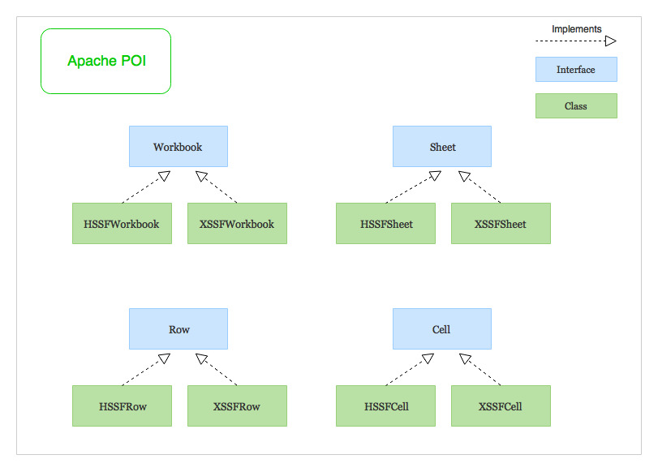

# Apache POI terminologies

Apache POI excel library revolves around following **four** key interfaces -

- (1) **Workbook**: A workbook is the high-level representation of a Spreadsheet.
- (2) **Sheet**: A workbook may contain many sheets.
- (3) **Row**: As the name suggests, It represents a row in the spreadsheet.
- (4) **Cell**: A cell represents a column in the spreadsheet.

## `HSSF` and `XSSF` implementations

Apache POI library consists of two different implementations for all the above interfaces.

- **HSSF** (**Horrible SpreadSheet Format**): HSSF implementations of POI’s high-level interfaces like `HSSFWorkbook`, `HSSFSheet`, `HSSFRow` and `HSSFCell` are used to work with excel files of the older binary file format - `.xls`
- **XSSF** (**XML SpreadSheet Format**): XSSF implementations are used to work with the newer XML based file format - `.xlsx`.

- (1) `HSSF` is prefixed before the class name to indicate operations related to a Microsoft Excel 2003 file.
- (2) `XSSF` is prefixed before the class name to indicate operations related to a Microsoft Excel 2007 file or later.
- (3) `XSSFWorkbook` and `HSSFWorkbook` are classes which act as an Excel Workbook
- (4) `HSSFSheet` and `XSSFSheet` are classes which act as an Excel Worksheet

- (1) Apache POI contains HSSF implementation for Excel ’97(-2007) file format i.e XLS.
- (2) Apache POI XSSF implementation should be used for Excel 2007 OOXML (.xlsx) file format.
- (3) Apache POI HSSF and XSSF API provides mechanisms to read, write or modify excel spreadsheets.
- (4) Apache POI also provides SXSSF API that is an extension of XSSF to work with very large excel sheets. SXSSF API requires less memory and is suitable when working with very large spreadsheets and heap memory is limited.
- (5) There are **two models** to choose from – **event model** and **user model**. Event model requires less memory because the excel file is read in tokens and requires processing them. User model is more object oriented and easy to use and we will use this in our examples.
- (6) Apache POI provides excellent support for additional excel features such as working with Formulas, creating cell styles by filling colors and borders, fonts, headers and footers, data validations, images, hyperlinks etc.

## Glossary

The Apache POI project contains the following subcomponents (meaning of acronyms is taken from old documentation):

- **POIFS** (Poor Obfuscation Implementation File System) – This component reads and writes Microsoft's OLE 2 Compound document format. Since all Microsoft Office files are OLE 2 files, this component is the basic building block of all the other POI elements. POIFS can therefore be used to read a wider variety of files, beyond those whose explicit decoders are already written in POI.
- **HSSF** (Horrible SpreadSheet Format) – reads and writes Microsoft Excel (XLS) format files. It can read files written by Excel 97 onwards; this file format is known as the BIFF 8 format. As the Excel file format is complex and contains a number of tricky characteristics, some of the more advanced features cannot be read.
- **XSSF** (XML SpreadSheet Format) – reads and writes Office Open XML (XLSX) format files. Similar feature set to HSSF, but for Office Open XML files.
- **HPSF** (Horrible Property Set Format) – reads "Document Summary" information from Microsoft Office files. This is essentially the information that one can see by using the File|Properties menu item within an Office application.
- **HWPF** (Horrible Word Processor Format) – aims to read and write Microsoft Word 97 (DOC) format files. This component is in initial stages of development.
- **XWPF** (XML Word Processor Format) – similar feature set to HWPF, but for Office Open XML files.
- **HSLF** (Horrible Slide Layout Format) – a pure Java implementation for Microsoft PowerPoint files. This provides the ability to read, create and edit presentations (though some things are easier to do than others)
- **HDGF** (Horrible DiaGram Format) – an initial pure Java implementation for Microsoft Visio binary files. It provides an ability to read the low level contents of the files.
- **HPBF** (Horrible PuBlisher Format) – a pure Java implementation for Microsoft Publisher files.
- **HSMF** (Horrible Stupid Mail Format[7]) – a pure Java implementation for Microsoft Outlook MSG files.[8]
- **DDF** (Dreadful Drawing Format) – a package for decoding the Microsoft Office Drawing format.

