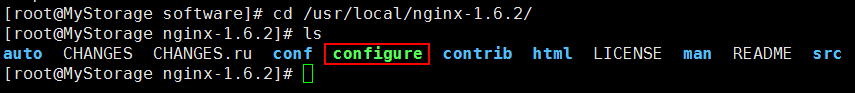
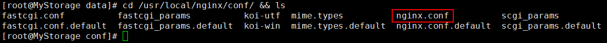

# FastDFS集群环境 #

## 1. FastDFS上传和下载的流程 ##

参考：The design principle of distributed file system FastDFS  [http://www.programering.com/a/MDN1kDNwATE.html](http://www.programering.com/a/MDN1kDNwATE.html)

client/tracker/storage的上传过程：  
1. client端向tracker节点发送上传文件请求；
1. tracker返回一台可用的storage节点；
1. client端直接和storage节点通讯完成文件的上传，并返回上传成功后的id给client端程序

client/tracker/storage的下载过程：  
1. client端向tracker节点发送下载请求；
1. tracker节点返回指定的目标storage节点；
1. client端直接与storage节点通讯完成下载操作。

## FastDFS集群环境搭建 ##

集群规划：
192.168.80.101 tracker-group1
192.168.80.102 tracker-group2
192.168.80.111 storage-group1
192.168.80.112 storage-group1
192.168.80.121 storage-group2
192.168.80.122 storage-group2

第一部分，安装相关软件，6台机器都需要安装

	yum makecache
	yum install -y wget
	yum install -y lrzsz
	yum install -y openssh-clients
	yum install -y tree
	yum install -y telnet
	yum install -y unzip

1、安装gcc和perl

	yum -y install make cmake gcc gcc-c++
	yum -y install perl

2、安装libfastcommon
（1）上传libfastcommon-master.zip到/usr/local/software下，进行解压：

	mkdir -p /usr/local/software
	cd /usr/local/software/
	rz -y

上传以下5个文件

	fastdfs-nginx-module_v1.16.tar.gz
	FastDFS_v5.05.tar.gz
	libfastcommon-master.zip
	nginx-1.6.2.tar.gz
	ngx_cache_purge-2.3.tar.gz

拷贝到各个机器上

	cd /usr/local/
	scp -r software/ 192.168.80.102:/usr/local/
	scp -r software/ 192.168.80.111:/usr/local/
	scp -r software/ 192.168.80.112:/usr/local/
	scp -r software/ 192.168.80.121:/usr/local/
	scp -r software/ 192.168.80.122:/usr/local/

解压

	cd /usr/local/software/
	unzip libfastcommon-master.zip -d /usr/local/fast

(2)进入/usr/local/fast/libfastcommon-master目录，进行编译和安装：

	cd /usr/local/fast/libfastcommon-master
	./make.sh
	./make.sh install

（3）进行软链接创建。

FastDFS主程序设置的目录为/usr/local/lib/，所以我们需要创建/usr/lib64/下的一些核心执行程序的软连接。

	mkdir -p /usr/local/lib/
	cd /usr/local/lib/

	ln -s /usr/lib64/libfastcommon.so /usr/local/lib/libfastcommon.so
	ln -s /usr/lib64/libfdfsclient.so /usr/local/lib/libfdfsclient.so
	ln -s /usr/lib64/libfastcommon.so /usr/lib/libfastcommon.so
	ln -s /usr/lib64/libfdfsclient.so /usr/lib/libfdfsclient.so

3、安装FastDFS

（1）进入到/usr/local/software目录下，解压FastDFS_v5.05.tar.gz文件

	cd /usr/local/software
	tar -zxvf FastDFS_v5.05.tar.gz -C /usr/local/fast/

（2）安装编译

切换到/usr/local/fast/FastDFS目录：
	
	cd /usr/local/fast/FastDFS

编译命令：

	./make.sh

安装命令：

	./make.sh install

（3）因为FastDFS服务脚本设置的bin目录为/usr/local/bin/下，但是实际上安装在/usr/bin/目录下，所以需要修改FastDFS配置文件中的路径。需要修改两个文件：fdfs_storaged和fdfs_trackerd。

修改fdfs_storaged文件

	vi /etc/init.d/fdfs_storaged

进行全局替换命令：

	%s+/usr/local/bin+/usr/bin

修改fdfs_trackerd文件

	vi /etc/init.d/fdfs_trackerd

进行全局替换命令：

	%s+/usr/local/bin+/usr/bin

第二部分：两台节点配置跟踪器

Tracker1: 192.168.80.101
Tracker2: 192.168.80.102

1、进入/etc/fdfs/目录，拷贝tracker的配置文件

	cd /etc/fdfs/
	cp tracker.conf.sample tracker.conf

2、编辑tracker.conf

	vi tracker.conf

修改以下内容

	base_path=/fastdfs/tracker
	store_lookup=0

创建对应的/fastdfs/tracker文件夹

	mkdir -p /fastdfs/tracker

启动跟踪器

	目录命令：cd /fastdfs/tracker
	启动tracker命令：/etc/init.d/fdfs_trackerd start
	查看进程命令： ps -el | grep fdfs 或者 netstat -tunpl | grep fdfs
	查看启动日志： tail -100 /fastdfs/tracker/logs/trackerd.log
	停止tracker命令：/etc/init.d/fdfs_trackerd stop

第三部分：四台机器配置Storage节点

Storage11: 192.168.80.111
Storage12: 192.168.80.112
Storage21: 192.168.80.121
Storage22: 192.168.80.122

4个节点中，同一组的配置应该是相同的，也就是说Storage11和Storage12是一组，Storage21和Storage22是一组。

1、首先进入4台机器的/etc/fdfs/目录，然后进行复制storage.conf文件

	cd /etc/fdfs/
	cp storage.conf.sample storage.conf

2、编辑storage.conf文件

	vi storage.conf

修改内容如下（注意两组的group_name是不一样的）：

	disabled=false #启用配置文件
	group_name=group1 #组名，第一组为group1，第二组为group2
	port=23000 #storage端口号，同一组的storage端口号必须相同
	base_path=/fastdfs/storage #设置storage的日志目录
	store_path_count=1 #存储路径个数，需要和store_path个数匹配
	store_path0=/fastdfs/storage #设置存储路径
	tracker_server=192.168.80.101:22122 #tracker服务器的IP和端口
	tracker_server=192.168.80.102:22122 #多个tracker直接添加多条配置
	http.server_port=8888 #设置http端口号

3、建立存储目录（需要和base_path=/fastdfs/storage保持一致）四个存储节点都建立

	mkdir -p /fastdfs/storage

4、启动storage

启动tracker命令：

	/etc/init.d/fdfs_storaged start

停止tracker命令：

	/etc/init.d/fdfs_storaged stop

日志命令：

	tail -f /fastdfs/storage/logs/storaged.log

5、一定要启动Tracker1和Tracker2两个跟踪器节点，然后分别启动第一组的存储节点Storage11和Storage12，通过日志命令可以发现:Storage11和Storage12是相互知道对方存在的，还可以发现跟踪器节点中的leader是哪一个。

跟踪器有主从选举算法，当跟踪器的leader节点挂掉了，那么跟踪器从节点也会切换为主节点。

6、当所有的tracker和storage节点都启动成功后，就可以在任意的一个storage节点上查看存储集群的信息：

	/usr/bin/fdfs_monitor /etc/fdfs/storage.conf

到此为止，存储节点环境搭建完毕。

第四部分：测试文件上传，需要修改配置跟踪器的客户端

配置Clinet(客户端)，即192.168.80.40节点。

(1)进入/etc/fdfs/目录，拷贝一份client的配置文件

	cd /etc/fdfs/
	cp client.conf.sample client.conf

(2)修改client.conf文件

	vi /etc/fdfs/client.conf

修改内容：

	base_path=/fastdfs/client
	tracker_server=192.168.80.101:22122
	tracker_server=192.168.80.102:22122

(3)创建client日志目录

	mkdir -p /fastdfs/client/

上传文件

	/usr/bin/fdfs_upload_file /etc/fdfs/client.conf beauty.jpg

第五部分：配置Nginx，首先4个存储节点配置Nginx，然后两个跟踪节点配置Nginx

1、解压fastdfs-nginx-module_v1.16.tar.gz

	cd /usr/local/software/
	tar -zxvf fastdfs-nginx-module_v1.16.tar.gz -C /usr/local/fast/

2、在安装fastdfs-nginx-module之前，对其路径进行修改

进入fastdfs-nginx-module/src/目录

	cd /usr/local/fast/fastdfs-nginx-module/src/ && ll

	vi config

修改内容：去掉下图中的local文件层次

修改完毕后为：

3、四个存储节点安装Nginx的依赖包

	yum -y install pcre
	yum -y install pcre-devel
	yum -y install zlib
	yum -y install zlib-devel

4、解压并安装nginx，加入fastdfs-nginx-module

	cd /usr/local/software/
	tar -zxvf nginx-1.6.2.tar.gz -C /usr/local/

进入/usr/local/nginx-1.6.2/目录

	cd /usr/local/nginx-1.6.2/

加入模块命令：

	./configure --add-module=/usr/local/fast/fastdfs-nginx-module/src/
	
重新编译命令：

	make && make install

5、复制fastdfs-nginx-module中的mod_fastdfs.conf配置文件到/etc/fdfs目录中

	cd /usr/local/fast/fastdfs-nginx-module/src/ && ll

	cp /usr/local/fast/fastdfs-nginx-module/src/mod_fastdfs.conf /etc/fdfs/

进入/etc/fdfs/目录中，修改mod_fastdfs.conf文件

	cd /etc/fdfs/ && ll

修改mod_fastdfs.conf文件

	vi /etc/fdfs/mod_fastdfs.conf

修改内容：比如连接超时时间、跟踪器路径配置、url的group配置

注意：第一组和第二组节点修改内容，不同的地方只有一个group_name组名。

	connect_timeout=10
	tracker_server=192.168.80.101:22122
	tracker_server=192.168.80.101:22122
	url_have_group_name = true
	store_path0=/fastdfs/storage
	group_name=group1 #第一组为group_name=group1，第二组为group_name=group2
	group_count=2

	[group1]
	group_name=group1
	storage_server_port=23000
	store_path_count=1
	store_path0=/fastdfs/storage
	
	[group2]
	group_name=group2
	storage_server_port=23000
	store_path_count=1
	store_path0=/fastdfs/storage

6、复制FastDFS里的2个文件，到/etc/fdfs/目录中，如图所示：

拷贝文件

	cd /usr/local/fast/FastDFS/conf/ && ll
	cp http.conf mime.types /etc/fdfs/

7、创建软连接

在/fastdfs/storage/目录下创建软连接，将其链接到实际存放数据的目录：

	ln -s /fastdfs/storage/data/ /fastdfs/storage/data/M00

(8)修改Nginx配置文件

	cd /usr/local/nginx/conf/ && ls

修改nginx.conf文件

	vi nginx.conf

修改配置内容：

	listen       8888;
	server_name  localhost;
    location ~/group([0-9])/M00 {
        #alias /fastdfs/storage/data;
        ngx_fastdfs_module;
    }

注意：nginx里的端口，需要与配置FastDFS Storage中的storage.conf文件配置一致，也就是http.server_port=8888。

(9)最后检查防火墙，然后启动nginx服务

关闭防火墙

	service iptables stop

启动nginx服务

	/usr/local/nginx/sbin/nginx

使用浏览器访问之前上传的文件：

	http://192.168.80.111:8888/group1/M00/00/00/wKhQcFn9S6yAXN8XAAGsUY4Xq7Q000.jpg

第六部分：需要在两个Tracker上安装Nginx，以提供反向代理服务，目的是使用同一个IP地址对外提供服务。

1、上传Nginx缓存模块，ngx_cache_purge-2.3.tar.gz，并进行解压

	cd /usr/local/software/
	tar -zxvf ngx_cache_purge-2.3.tar.gz -C /usr/local/fast

2、下载需要的依赖库文件

	yum -y install pcre
	yum -y install pcre-devel
	yum -y install zlib
	yum -y install zlib-devel

3、解压并安装nginx，加入ngx_cache_purge（加入缓存模块）

	cd /usr/local/software/
	tar -zxvf nginx-1.6.2.tar.gz -C /usr/local/

进入nginx目录

	cd /usr/local/nginx-1.6.2/
	
加入模块命令：

	./configure --add-module=/usr/local/fast/ngx_cache_purge-2.3/

编译命令：

	make && make install

4、配置nginx负载均衡和缓存

	vi /usr/local/nginx/conf/nginx.conf

内容如下：

	#user  root;
	worker_processes  1;
	
	#error_log  logs/error.log;
	#error_log  logs/error.log  notice;
	#error_log  logs/error.log  info;
	
	#pid        logs/nginx.pid;
	
	
	events {
	    worker_connections  1024;
	    use epoll;
	}
	
	http {
	    include       mime.types;
	    default_type  application/octet-stream;
	
	    #log_format  main  '$remote_addr - $remote_user [$time_local] "$request" '
	    #                  '$status $body_bytes_sent "$http_referer" '
	    #                  '"$http_user_agent" "$http_x_forwarded_for"';
	
	    #access_log  logs/access.log  main;
	
	    sendfile        on;
	    tcp_nopush     on;
	
	    #keepalive_timeout  0;
	    keepalive_timeout  65;
	
	    #gzip  on;
	
		#设置缓存
	    server_names_hash_bucket_size 128;
	    client_header_buffer_size 32k;
		large_client_header_buffers 4 32k;
		client_max_body_size 300m;
	
		proxy_redirect off;
		proxy_set_header Host $http_host;
		proxy_set_header X-Real-IP $remote_addr;
		proxy_set_header X-Forwarded-For $proxy_add_x_forwarded_for;
	
		proxy_connect_timeout 90;
		proxy_send_timeout 90;
		proxy_read_timeout 90;
		proxy_buffer_size 16k;
		proxy_buffers 4 64k;
		proxy_busy_buffers_size 128k;
		proxy_temp_file_write_size 128k;
	
		#设置缓存存储路径，存储方式，分别内存大小，磁盘最大空间，缓存期限
		proxy_cache_path /fastdfs/cache/nginx/proxy_cache levels=1:2
		keys_zone=http-cache:200m max_size=1g inactive=30d;
		proxy_temp_path /fastdfs/cache/nginx/proxy_cache/tmp;
	
		#group1的服务设置
		upstream fdfs_group1 {
			server 192.168.80.111:8888 weight=1 max_fails=2 fail_timeout=30s;
			server 192.168.80.112:8888 weight=1 max_fails=2 fail_timeout=30s;
		}
		#group2的服务设置
		upstream fdfs_group2 {
			server 192.168.80.121:8888 weight=1 max_fails=2 fail_timeout=30s;
			server 192.168.80.122:8888 weight=1 max_fails=2 fail_timeout=30s;
		}
	
	    server {
	        listen       8000;
	        server_name  localhost;
	
	        #charset koi8-r;
	
	        #access_log  logs/host.access.log  main;
			#group1的负载均衡配置
	        location /group1/M00 {
	            proxy_next_upstream http_502 http_504 error timeout invalid_header;
	            proxy_cache http-cache;
				proxy_cache_valid 200 304 12h;
				proxy_cache_key $uri$is_args$args;
				#对应group1的服务设置
				proxy_pass http://fdfs_group1;
				expires 30d;
	        }
			#group2的负载均衡配置
	        location /group2/M00 {
	            proxy_next_upstream http_502 http_504 error timeout invalid_header;
	            proxy_cache http-cache;
				proxy_cache_valid 200 304 12h;
				proxy_cache_key $uri$is_args$args;
				#对应group2的服务设置
				proxy_pass http://fdfs_group2;
				expires 30d;
	        }
			#清除缓存的访问权限
			location ~/purge(/.*) {
				allow 127.0.0.1;
				allow 192.168.80.0/24;
				deny all;
				proxy_cache_purge http-cache $1$is_args$args;
			}
		
	        #error_page  404              /404.html;
	
	        # redirect server error pages to the static page /50x.html
	        #
	        error_page   500 502 503 504  /50x.html;
	        location = /50x.html {
	            root   html;
	        }
		}
	}

5、最后千万记得需要创建缓存的使用目录

	mkdir -p /fastdfs/cache/nginx/proxy_cache
	mkdir -p /fastdfs/cache/nginx/proxy_cache/tmp

6、最后检查防火墙，启动nginx即可（注意nginx端口为8000）

	/usr/local/nginx/sbin/nginx
	ps -ef | grep nginx

