# FastDFS单节点安装 #

1、FastDFS简介与安装
2、FastDFS的JavaClient端API操作
3、FastDFS的集群环境搭建
4、FastDFS的应用场景使用

使用简单，安装比较麻烦

1.1、FastDFS简介
FastDFS是一个开源的轻量级的分布式文件系统，它对文件进行管理，功能包括：文件存储、文件同步、文件访问（文件上传、文件下载）等，解决了大容量存储和负载均衡的问题。特别适合以文件为载体的在线服务，如相册网站、视频网站等等。

FastDFS适用的场景以及不适用的场景？

FastDFS软件包下载地址：[https://sourceforge.net/projects/fastdfs/files/](https://sourceforge.net/projects/fastdfs/files/)

FastDFS源码包下载地址：[https://github.com/happyfish100](https://github.com/happyfish100)

单个节点安装，需要安装Tracker、Storage，以及要使用Http访问，需要进行集成Nginx模块。其中，Tracker类似于Storm的Nimbus，负责管理Storage，而Storage是真正存储文件的地方。

Linux安装FastDFS步骤：
1、下载软件包，安装gcc包
2、安装libfastcommon
3、安装FastDFS
4、配置跟踪器(tracker)
5、配置存储器（storage）
6、环境搭建完成，可以进行测试环境是否搭建成功
7、跟踪器和存储器安装Nginx，之前已经安装完毕了，我们可以对Nginx进行整合，实现使用浏览器下载文件
8、启动和关闭服务顺序：跟踪器、存储器、Nginx

FastDFS安装手册

## 1. 准备工作 ##

准备三台机器
Client:  192.168.80.40
Tracker: 192.168.80.41
Storage: 192.168.80.42

	yum makecache
	yum install -y wget
	yum install -y lrzsz
	yum install -y openssh-clients
	yum install -y tree
	yum install -y telnet
	yum install -y unzip

1、下载软件：https://github.com/happyfish100

都有哪些软件呢？

mkdir -p /usr/local/software

创建/usr/local/software目录下

	mkdir -p /usr/local/software
	cd /usr/local/software/

上传以下软件包

	libfastcommon-master.zip
	FastDFS_v5.05.tar.gz
	nginx-1.6.2.tar.gz
	fastdfs-nginx-module_v1.16.tar.gz

2、安装gcc，使用如下命令：

	yum -y install make cmake gcc gcc-c++

https://github.com/happyfish100/libfastcommon

## 2. 安装libfastcommon ##

三台机器同时进行以下操作

1、切换到/usr/local/software/目录下

	cd /usr/local/software/

2、解压libfastcommon-master.zip，命令如下：

	unzip libfastcommon-master.zip -d /usr/local/fast

3、进入/usr/local/fast/libfastcommon-master目录： 

	cd /usr/local/fast/libfastcommon-master

4、进行编译和安装

编译命令：

	./make.sh

使用`./make.sh`进行编译，遇到`perl: command not found`错误

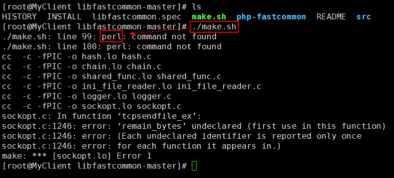

使用以下命令安装perl：

	yum -y install perl

再次执行编译命令：

	./make.sh

安装命令：

	./make.sh install

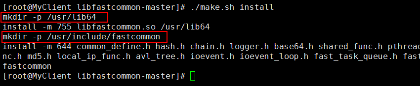

注意：libfastcommon默认安装到了`/usr/lib64/`这个位置 

5、进行软件创建。

FastDFS主程序设置的目录为/usr/local/lib/，所以我们需要创建/usr/lib64/下的一些核心执行程序的软连接

	mkdir -p /usr/local/lib/
	cd /usr/local/lib/

	ln -s /usr/lib64/libfastcommon.so /usr/local/lib/libfastcommon.so
	ln -s /usr/lib64/libfdfsclient.so /usr/local/lib/libfdfsclient.so
	ln -s /usr/lib64/libfastcommon.so /usr/lib/libfastcommon.so
	ln -s /usr/lib64/libfdfsclient.so /usr/lib/libfdfsclient.so

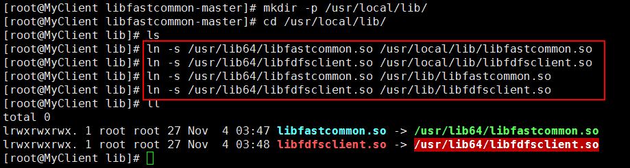

## 3. 安装FastDFS ##

1、进入到/usr/local/software目录下，解压FastDFS_v5.05.tar.gz文件

	cd /usr/local/software
	tar -zxvf FastDFS_v5.05.tar.gz -C /usr/local/fast/

2、安装编译

切换到/usr/local/fast/FastDFS目录：
	
	cd /usr/local/fast/FastDFS

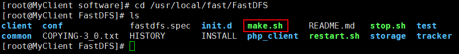

编译命令：

	./make.sh

安装命令：

	./make.sh install

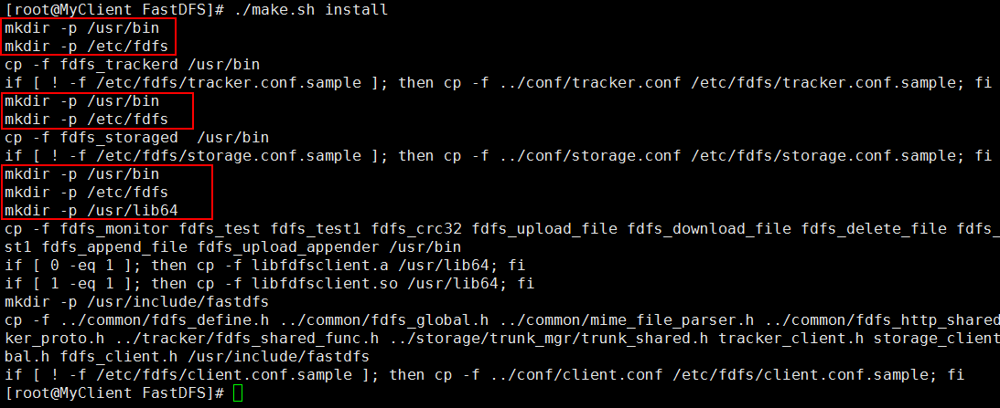

3、采用默认安装方式脚本文件说明

(1)服务脚本在:

/etc/init.d/fdfs_storaged
/etc/init.d/fdfs_trackerd

查看/etc/init.d/目录命令：

	cd /etc/init.d/ && ls | grep fdfs

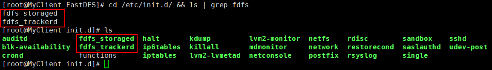

(2)配置文件在:

/etc/fdfs/client.conf.sample
/etc/fdfs/storage.conf.sample
/etc/fdfs/tracker.conf.sample

查看/etc/fdfs/目录命令：

	cd /etc/fdfs/ && ll

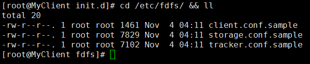

(3)命令行工具

在/usr/bin/目录下有一些fdfs_*的一系列执行脚本

	cd /usr/bin/ && ls | grep fdfs

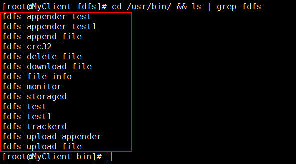

4、设置FastDFS服务脚本中的bin目录

因为FastDFS服务脚本设置的bin目录为/usr/local/bin/下，但是实际上安装在/usr/bin/目录下，所以需要修改FastDFS配置文件中的路径。需要修改两个文件：fdfs_storaged和fdfs_trackerd。

修改fdfs_storaged文件

	vi /etc/init.d/fdfs_storaged

进行全局替换命令：

	%s+/usr/local/bin+/usr/bin

修改fdfs_trackerd文件

	vi /etc/init.d/fdfs_trackerd

进行全局替换命令：

	%s+/usr/local/bin+/usr/bin

## 4. 配置Tracker ##

配置Tracker(跟踪器)，即192.168.80.41节点。

(1)进入/etc/fdfs目录

	cd /etc/fdfs/
	cp tracker.conf.sample tracker.conf

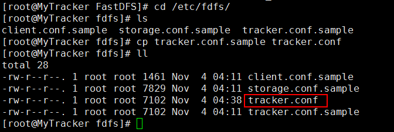

(2)修改tracker.conf文件

	vi /etc/fdfs/tracker.conf

暂时修改配置文件里的base_path即可，如下图：

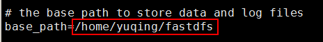

修改为自己的路径地址：base_path=/fastdfs/tracker
注意：对于tracker.conf配置文件参数解释可以查找官方文档

(3)创建之前定义好的目录，即base_path中指定的目录

	mkdir -p /fastdfs/tracker

(4)关闭防火墙

	vi /etc/sysconfig/iptables

添加如下内容：

	-A INPUT -m state --state NEW -m tcp -p tcp --dport 22122 -j ACCEPT

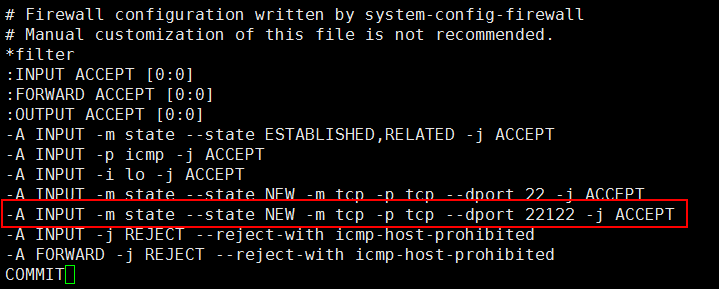

重启防火墙

	service iptables restart

(5)启动跟踪器

注意：启动之前和启动之后，tracker.confg中指定base_path目录的内容变化：增加了data和logs目录。

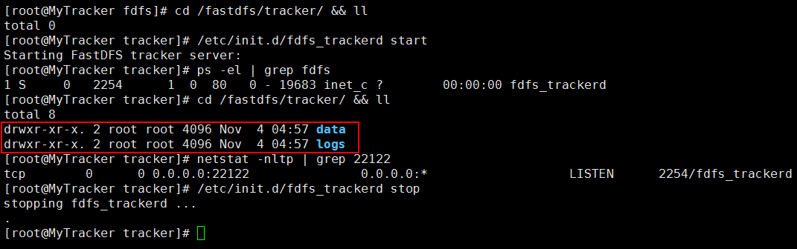

查看目录命令：

	cd /fastdfs/tracker/ && ll

启动tracker命令：

	/etc/init.d/fdfs_trackerd start

停止tracker命令：

	/etc/init.d/fdfs_trackerd stop

查看进程命令：

	ps -el | grep fdfs
	netstat -nltp | grep 22122

(6)设置开机启动Tracker

一般生产环境需要开机启动一些服务，如keeplived、tomcat等。可以通过修改以下文件添加Tracker的开机启动：

	vi /etc/rc.d/rc.local

添加如下配置：

	/etc/init.d/fdfs_trackerd start

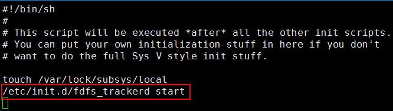

## 5. 配置Storage ##

配置Storage(存储器)，即192.168.80.42节点。

(1)进入/etc/fdfs/目录，拷贝一份storage的配置文件

	cd /etc/fdfs/
	cp storage.conf.sample storage.conf

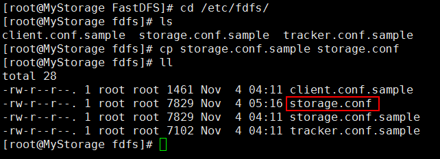

(2)修改storage.conf文件

	vi /etc/fdfs/storage.conf

修改内容：

	base_path=/fastdfs/storage
	store_path0=/fastdfs/storage
	tracker_server=192.168.80.41:22122
	http.server_port=8888

(3)创建存储目录

	mkdir -p /fastdfs/storage

(4)打开防火墙

	vi /etc/sysconfig/iptables

添加如下内容：

	-A INPUT -m state --state NEW -m tcp -p tcp --dport 23000 -j ACCEPT

重启防火墙

	service iptables restart

(5)启动存储器(Storage)

注意：启动之前和启动之后，storage.confg中指定base_path目录的内容变化：增加了data和logs目录。

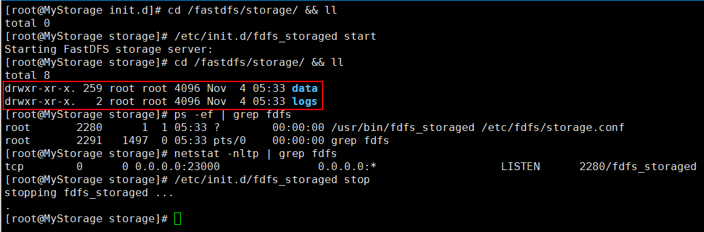

查看目录命令：

	cd /fastdfs/storage/ && ll

启动storage命令：

	/etc/init.d/fdfs_storaged start

停止storage命令：

	/etc/init.d/fdfs_storaged stop

查看进程命令：

	ps -ef | grep fdfs
	netstat -nltp | grep fdfs

进入到/fastdfs/storage/data/目录下，会看到一些目录文件（256*156），如下：

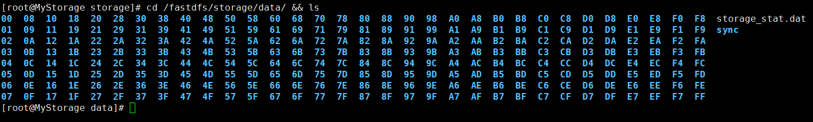

(6)设置开机启动Storage

可以通过修改以下文件添加Storage的开机启动：

	vi /etc/rc.d/rc.local

添加如下配置：

	/etc/init.d/fdfs_storaged start

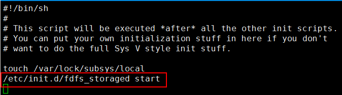

## 7. 配置Client环境 ##

配置Clinet(客户端)，即192.168.80.40节点。

(1)进入/etc/fdfs/目录，拷贝一份client的配置文件

	cd /etc/fdfs/
	cp client.conf.sample client.conf

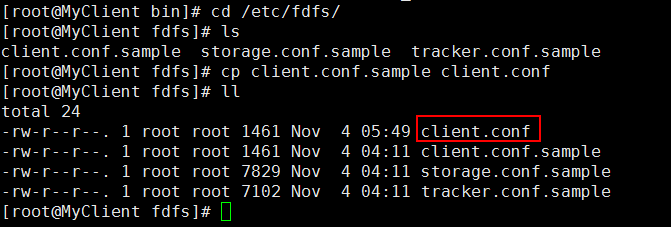

(2)修改client.conf文件

	vi /etc/fdfs/client.conf

修改内容：

	base_path=/fastdfs/client
	tracker_server=192.168.80.41:22122

(3)创建client日志目录

	mkdir -p /fastdfs/client/

(4)找到client命令的脚本位置，并使用命令进行文件上传

	cd /usr/bin/ && ls | grep fdfs

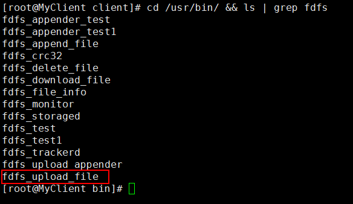

(5)使用命令fdfs_upload_file进行上传操作

	/usr/bin/fdfs_upload_file /etc/fdfs/client.conf beauty.jpg

上传之后的文件为：

	group1/M00/00/00/wKhQKln85ouARXzUAAGsUY4Xq7Q145.jpg

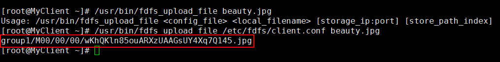

在Storage（即192.168.80.42节点）上可以进行查看：

	cd /fastdfs/storage/data/00/00/ && ll

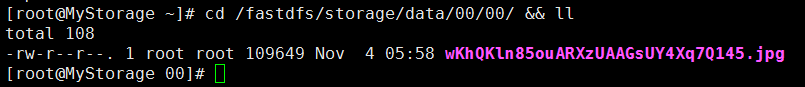

## 7. FastDFS与Nginx整合 ##

(1)在Storage(即192.168.80.42存储节点）上，安装fastdfs-nginx-module_v1.16.tar.gz

	cd /usr/local/software/
	tar -zxvf fastdfs-nginx-module_v1.16.tar.gz -C /usr/local/fast/

(2)进入fastdfs-nginx-module/src/目录，修改config文件

	cd /usr/local/fast/fastdfs-nginx-module/src/ && ll

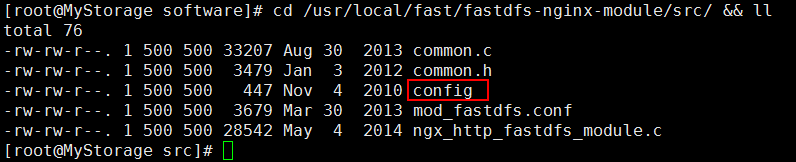

	vi config

修改内容：去掉下图中的local文件层次

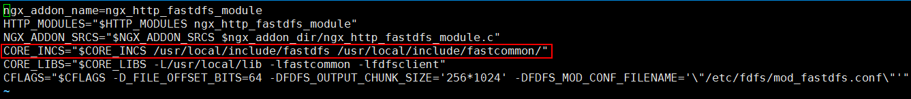

修改完毕后为：

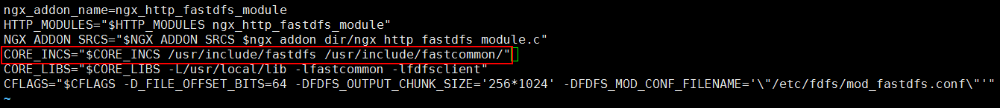

(3)FastDFS与nginx进行集成

如果之前安装过nginx进行删除：

	#进行目录
	cd /usr/local/
	#删除
	rm -rf nginx

如果没有安装过nginx，则进行如下操作：

	#安装nginx所需要的依赖库文件
	yum -y install pcre
	yum -y install pcre-devel
	yum -y install zlib
	yum -y install zlib-devel

	#解压nginx
	cd /usr/local/software/
	tar -zxvf nginx-1.6.2.tar.gz -C /usr/local/

进入/usr/local/nginx-1.6.2/目录

	cd /usr/local/nginx-1.6.2/

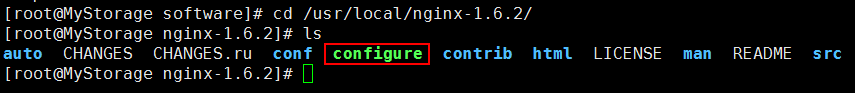

加入模块命令：

	./configure --add-module=/usr/local/fast/fastdfs-nginx-module/src/
	
重新编译命令：

	make && make install

(4)复制fastdfs-nginx-module中的mod_fastdfs.conf配置文件到/etc/fdfs目录中

	cd /usr/local/fast/fastdfs-nginx-module/src/ && ll

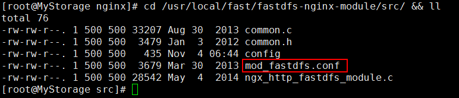

	cp /usr/local/fast/fastdfs-nginx-module/src/mod_fastdfs.conf /etc/fdfs/

(5)进入/etc/fdfs/目录中，修改mod_fastdfs.conf文件

	cd /etc/fdfs/ && ll

修改mod_fastdfs.conf文件

	vi /etc/fdfs/mod_fastdfs.conf

修改内容：比如连接超时时间、跟踪器路径配置、url的group配置

	connect_timeout=10
	tracker_server=192.168.80.41:22122
	url_have_group_name = true
	store_path0=/fastdfs/storage

(6)复制FastDFS里的2个文件，到/etc/fdfs/目录中，如图所示：

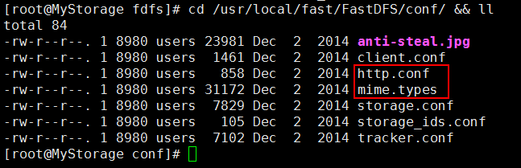

拷贝文件

	cp http.conf mime.types /etc/fdfs/

(7)创建软连接

在/fastdfs/storage/目录下创建软连接，将其链接到实际存放数据的目录：

	ln -s /fastdfs/storage/data/ /fastdfs/storage/data/M00

(8)修改Nginx配置文件

	cd /usr/local/nginx/conf/ && ls

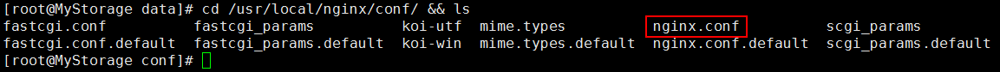

修改nginx.conf文件

	vi nginx.conf

修改配置内容：

	listen       8888;
	server_name  localhost;
    location ~/group([0-9])/M00 {
        #alias /fastdfs/storage/data;
        ngx_fastdfs_module;
    }

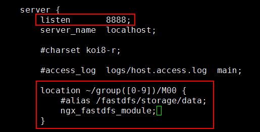

注意：nginx里的端口，需要与配置FastDFS Storage中的storage.conf文件配置一致，也就是http.server_port=8888。

(9)最后检查防火墙，然后启动nginx服务

关闭防火墙

	service iptables stop

启动nginx服务

	/usr/local/nginx/sbin/nginx

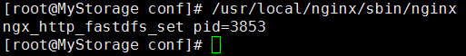

使用浏览器访问之前上传的文件：

	http://192.168.80.42:8888/group1/M00/00/00/wKhQKln85ouARXzUAAGsUY4Xq7Q145.jpg

运维注意：在使用FastDFS的时候，需要正常关机，不要使用kill -9强杀FastDFS进程，否则会出现文件上传时丢失数据的情况。至此，FastDFS与Nginx整合完毕。

## 8. 启动停止服务步骤 ##

启动命令：

	#启动tracker命令
	/etc/init.d/fdfs_trackerd start
	#查看进程命令：
	ps -ef | grep fdfs
	
	#启动storage命令
	/etc/init.d/fdfs_storaged start
	#查看进程命令
	ps -ef | grep fdfs
	
	#启动nginx命令
	/usr/local/nginx/sbin/nginx

停止命令：

	#停止tracker命令
	/etc/init.d/fdfs_trackerd stop
	
	#停止storage命令
	/etc/init.d/fdfs_storaged stop
	
	#关闭nginx命令
	/usr/local/nginx/sbin/nginx -s stop

> 至此结束