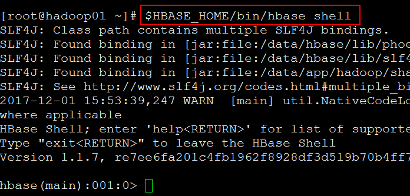
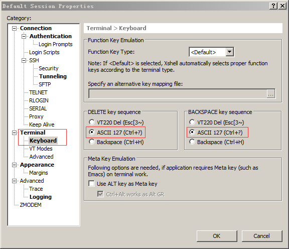

# HBase 常用Shell命令 #

原地址：[HBase 常用Shell命令](https://www.cnblogs.com/hunttown/p/5799850.html)

## 1、通用命令 ##

进入hbase shell console

	$HBASE_HOME/bin/hbase shell

注意：需要在/etc/profile中配置HBASE_HOME，例如：

	export HBASE_HOME=/data/hbase
	export PATH=$HBASE_HOME/bin:$PATH

查看用户的信息

	hbase(main)> whoami

查看正在使用的HBase版本

	hbase(main)> version

查看HBase的状态，例如，服务器的数量

	hbase(main)> status

查看表引用命令提供帮助

	hbase(main)> table_help

退出hbase shell console

	hbase(main)> quit

## 2、表的管理 ##

### 2.1、查看有哪些表 ###

	hbase(main)> list

### 2.2、创建表 ###

	# 语法：create <table>, {NAME => <family>, VERSIONS => <VERSIONS>}
	# 例如：创建表t1，有两个family name：f1，f2，且版本数均为2
	
	hbase(main)> create 't1',{NAME => 'f1', VERSIONS => 2},{NAME => 'f2', VERSIONS => 2}

### 2.3、删除表 ###

	# 分两步：首先disable，然后drop
	# 例如：删除表t1
	
	hbase(main)> disable 't1'
	hbase(main)> drop 't1'

### 2.4、查看表的结构 ###

	# 语法：describe <table>
	# 例如：查看表t1的结构
	
	hbase(main)> describe 't1'

### 2.5、修改表结构 修改表结构必须先disable ###

	# 语法：alter 't1', {NAME => 'f1'}, {NAME => 'f2', METHOD => 'delete'}
	# 例如：修改表test1的cf的TTL为180天
	
	hbase(main)> disable 'test1'
	hbase(main)> alter 'test1',{NAME=>'body',TTL=>'15552000'},{NAME=>'meta', TTL=>'15552000'}
	hbase(main)> enable 'test1'

## 3、权限管理 ##

1）分配权限

	# 语法 : grant <user> <permissions> <table> <column family> <column qualifier> 参数后面用逗号分隔
	# 权限用五个字母表示： "RWXCA".
	# READ('R'), WRITE('W'), EXEC('X'), CREATE('C'), ADMIN('A')
	# 例如，给用户‘test'分配对表t1有读写的权限，
	
	hbase(main)> grant 'test','RW','t1'

2）查看权限

	# 语法：user_permission <table>
	# 例如，查看表t1的权限列表
	
	hbase(main)> user_permission 't1'

3）收回权限

	# 与分配权限类似，语法：revoke <user> <table> <column family> <column qualifier>
	# 例如，收回test用户在表t1上的权限
	
	hbase(main)> revoke 'test','t1'

## 4、表数据的增删改查 ##

### 4.1、添加数据 ###

	# 语法：put <table>,<rowkey>,<family:column>,<value>,<timestamp>
	# 例如：给表t1的添加一行记录：rowkey是rowkey001，family name：f1，column name：col1，value：value01，timestamp：系统默认
	hbase(main)> put 't1','rowkey001','f1:col1','value01'
	#用法比较单一。

### 4.2、查询数据 ###

a）查询某行记录

	# 语法：get <table>,<rowkey>,[<family:column>,....]
	# 例如：查询表t1，rowkey001中的f1下的col1的值
	hbase(main)> get 't1','rowkey001', 'f1:col1'
	
	# 或者：
	hbase(main)> get 't1','rowkey001', {COLUMN=>'f1:col1'}
	
	# 查询表t1，rowke002中的f1下的所有列值
	hbase(main)> get 't1','rowkey001'

b）扫描表

	# 语法：scan <table>, {COLUMNS => [ <family:column>,.... ], LIMIT => num}
	# 另外，还可以添加STARTROW、TIMERANGE和FITLER等高级功能
	# 例如：扫描表t1的前5条数据
	hbase(main)> scan 't1',{LIMIT=>5}

c）查询表中的数据行数

	# 语法：count <table>, {INTERVAL => intervalNum, CACHE => cacheNum}
	# INTERVAL设置多少行显示一次及对应的rowkey，默认1000；CACHE每次去取的缓存区大小，默认是10，调整该参数可提高查询速度
	# 例如，查询表t1中的行数，每100条显示一次，缓存区为500
	hbase(main)> count 't1', {INTERVAL => 100, CACHE => 500}

### 4.3、删除数据 ###

a)删除行中的某个列值

	# 语法：delete <table>, <rowkey>,  <family:column> , <timestamp>,必须指定列名
	# 例如：删除表t1，rowkey001中的f1:col1的数据
	hbase(main)> delete 't1','rowkey001','f1:col1'
	注：将删除改行f1:col1列所有版本的数据

b)删除行

	# 语法：deleteall <table>, <rowkey>,  <family:column> , <timestamp>，可以不指定列名，删除整行数据
	# 例如：删除表t1，rowk001的数据
	hbase(main)> deleteall 't1','rowkey001'

c）删除表中的所有数据

	# 语法： truncate <table>
	# 其具体过程是：disable table -> drop table -> create table
	# 例如：删除表t1的所有数据
	hbase(main)> truncate 't1'

## 5、Region管理 ##

1）移动region

	# 语法：move 'encodeRegionName', 'ServerName'
	# encodeRegionName指的regioName后面的编码，ServerName指的是master-status的Region Servers列表
	# 示例
	hbase(main)>move '4343995a58be8e5bbc739af1e91cd72d', 'db-41.xxx.xxx.org,60020,1390274516739'

2）开启/关闭region

	# 语法：balance_switch true|false
	hbase(main)> balance_switch

3）手动split

	# 语法：split 'regionName', 'splitKey'

4）手动触发major compaction

	#语法：
	#Compact all regions in a table:
	#hbase> major_compact 't1'
	#Compact an entire region:
	#hbase> major_compact 'r1'
	#Compact a single column family within a region:
	#hbase> major_compact 'r1', 'c1'
	#Compact a single column family within a table:
	#hbase> major_compact 't1', 'c1'

## 6、配置管理及节点重启 ##

1）修改hdfs配置 hdfs配置位置：/etc/hadoop/conf

	# 同步hdfs配置
	cat /home/hadoop/slaves|xargs -i -t scp /etc/hadoop/conf/hdfs-site.xml hadoop@{}:/etc/hadoop/conf/hdfs-site.xml
	# 关闭：
	cat /home/hadoop/slaves|xargs -i -t ssh hadoop@{} "sudo /home/hadoop/cdh4/hadoop-2.0.0-cdh4.2.1/sbin/hadoop-daemon.sh --config /etc/hadoop/conf stop datanode"
	# 启动：
	cat /home/hadoop/slaves|xargs -i -t ssh hadoop@{} "sudo /home/hadoop/cdh4/hadoop-2.0.0-cdh4.2.1/sbin/hadoop-daemon.sh --config /etc/hadoop/conf start datanode"

2）修改hbase配置

	# hbase配置位置：
	# 同步hbase配置
	cat /home/hadoop/hbase/conf/regionservers|xargs -i -t scp /home/hadoop/hbase/conf/hbase-site.xml hadoop@{}:/home/hadoop/hbase/conf/hbase-site.xml

	# graceful重启
	cd ~/hbase
	bin/graceful_stop.sh --restart --reload --debug inspurXXX.xxx.xxx.org

## 7、Hbase shell退格键不好使。 ##

在File->Properties->Terminal->Keyboard下，把DELETE/BACKSPACE key sequence选为ASCII 127(Ctrl+?)。  
这样在hbase shell下，DELETE/BACKSPACE终于听使唤了。

