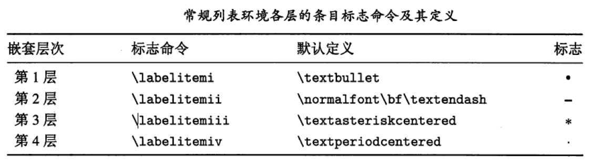

先在文件的开头添加宏包：

\usepackage{amssymb}

\usepackage{amsmath}

百分号可以用  \%  来输入，反斜杠用  \backslash  输入。（注意反斜杠算符号，要在$...$或者$$...$$中输入）

要输入的文字可以用如下语句：
\%123$\backslash$dadss

求和

```latex
\begin{displaymath}
\sum_{i=1}^{n}
\end{displaymath}
```

[常用数学符号的 LaTeX 表示方法](http://www.mohu.org/info/symbols/symbols.htm)

http://blog.sina.com.cn/s/blog_5e16f1770100fs38.html

    https://www.cnblogs.com/GarfieldEr007/p/5577727.html

    

    http://blog.csdn.net/u014803202/article/details/50410748

p(\epsilon^{(i)})=\frac{1}{\sqrt{2\pi}\sigma}e^{-\frac{(\epsilon^{(i)})^{2}}{2\sigma^{2}}}

[LaTeX 设置字体颜色](http://blog.csdn.net/yhl_leo/article/details/50240179)
[Latex中如何设置字体颜色（三种方式）](https://www.cnblogs.com/tsingke/p/7457236.html)

如何在公式中表示上下堆积关系？

答：在latex有一个命令\stackre{上部符号}{下部符号}，但更好的一个是用宏包
amslatex中命令\overset和\underset。一个例子是
\[ \overset{*}{X} \qquad
\underset{*}{X} \qquad
\overset{a}{\underset{b}{X}} \]


WinEdt显示行号

	在编辑窗口中右键点击左侧边框，【右键】-【Show Line Numbers】。
	若要取消行号，在左侧边框上【右键】-【Hide  Line Numbers】

WinEdt修改字体大小

	Options-->Preferences-->Font

LaTeX小技巧——File ended while scanning use of \@writefile错误的

http://blog.sina.com.cn/s/blog_631a4cc40101otu6.html

早上在修改编译论文时发现了这个问题，仔细检查代码并没发现错误，一时也找不到具体的解决办法。我一直以为是因为runaway argument的错误提示，可实际上就是因为aux文件没有完整输入，导致上次编译结束后aux文件的部分内容缺失。处理方法嘛，很简单。

解决方法：删除编译文件夹内.aux扩展名结尾的文件，重新用Latex命令进行编译，自动生成正确的aux文件，完成错误的修复。

注：如果还不好使，就把除.tex以外的文件均删除掉，如：.bbl,.blg,.dvi,.log等


# HelloWorld #

第1个文档

```latex
\documentclass{article}  
\begin{document}  
This is our first document.  
\end{document} 
```

缩放：使用Texworks的时候，按下**Ctrl+加号**或**Ctrl+减号**可以在预览窗口进行缩放。

`\documentclass`表示文档类型，常见的有article、book、report这些类型

# 单词、句子和段落的输入 #

第2个文档 

```latex
\documentclass[a4paper,11pt]{article}
\begin{document}
\title{Example 2}
\author{My name}
\date{January 5, 2011}
\maketitle
\section{What's this?}
This is our second document. It contains a title and a section with text.
\end{document}
```

第一行以\documentclass开始，我们留意到该单词以
反斜杠开头，这种类型的单词在 LaTeX 里被称为**命令**。我们使用了\documentclass[a4paper,11pt]  {article}，这时文档将使用 11pt 的字号并采用A4 纸张。

我们使用**命令**列出文档的类别(documentclass)并声明文档的属性(title,author和date)。

文档的第一部分称为引言(preamble)。在这里我们选择类别，声明属性。 

\begin{document}是实际文档的正式开始也意味着引言的结束，\end{document} 是文档的结束。类似于\begin … \end的命令对，称为**环境(environment)**。

在文档中，使用  \maketitle 打印  title, author和  date。  通过  \section 命令，
我们生成了一个标题，字号比正常文本大并且加粗。


## 关于Latex命令 ##

有的命令可能有参数，在大括号或者中括号里： 
Calling a command looks like the following:   

	\command  

Or:   

	\command{argument}  

Or:   

	\command[optional argument]{argument} 

在中括号或者大括号里的参数有可能有一个或者几个，大括号里的参数是必须的。如果一个命令定义为需要参数，我们必须给出。比如，对于命令\documentclass，如果我们不给出参数名称将不能工作。

中括号里的参数是可选的，不是必须的。如果没有给出可选参数，命令将使用默认值。比如在第一个例子中我们使用\documentclass{article}，这个文档将使用字号的大小是 10pt，因为这是这个类的默认字号大小。在第二个例子中，我们使用了\documentclass[a4paper,11pt]  {article}，这时文档将使用 11pt 的字号并采用A4 纸张。

## 使用空白，断行和空行的效果 ##

尽管我们插入了一些空白，但是单词间的距离还是相同的。原因是 LaTeX 对多个空白认为是单个空格。

另外，断行和单个空格有相同的作用。因此你可以在你的
文档里随意使用空白和断行。 

空行意味着分段。和空白类似，多个空行和一个空行相同。

**简单地说，空白（字符）分割单词，空行分割段落**。

## 注释你的源文件 ##

我们可以看到上面的输出没有显示原文件里的最后一行，% Here's a comment. 这是因为**百分号**表示注释的含义。所有在注释符号后面的字符直到该行结束都会被LaTeX忽略并不被输出。

## 断词 ##

LaTeX  直接设定全文自动断词，通常无须手动设置。例如单词 logarithm，其中部若处于文本行的右端，系统可根据情况将它断为 loga-  ，其余部分移至下一行行首。但有时希望改变某个单词的断词位置，使单词间距更为均匀，有时并不希望某个单词或缩略语被断词，以防产生误解，这就需要采取措施，使系统能够按照作者的要求进行断词。

断词命令

若希望为某个单词设置或增加断词位置，可将系统提供的断词命令: 

	\- 

插在希望断词的地方，以指示系统这是一个可断点，可在此处断词。例如: logari\-thm  ，它指示系统不仅可将它断为 loga-  ，还可根据情况将它断为 logari-  。 

有些英文词汇是带有非字母符号的组合词，例如 x-radiation  ，应视为一个单词，可使用断词命令设置多个可断点 x-ra\-di\-a\-tion  ，以尽量避免换行时在x-之后被断词。


## 连词  ##

有时希望几个单词连接为一个整体，不要因为换行而被断开。比如英文姓名及其头衔如教授、博士等都要排于一行之内，而不应被断为两行。例如高德纳教授: Prof. D. E. Knuth，就很容易被从中断开；如果这样书写: Prof. -D. -E. -Knuth  ，就不会被断开了。 

中文姓名不应被断行，英文姓名也应尽量避免。中文姓名及其头衔也要留意这一问题，可采取各种修辞方法调整语句顺序，尽可能避免被断行。


## 句号后的空白  ##

在输入英文时，单词之间和标点符号之后都会空一格。通常在句号之后紧跟一个空格，系统会认为这是一句的结尾，将在其后插入比词距宽一些的空白。但并不是所有句号跟空格就是句尾，有以下几种例外情况。

在论文中时常会出现人名或者缩略语，例如 Donald E. Knuth，其中的句号是缩略的表示，并非一句结束。故此，紧跟在大写字母后的句号，系统不视其为句尾，仅在其后插入词距所需的空白。

有时缩略语或计量单位等大写字母就在句尾，这时要在大写字母与句号之间插入**句尾命令**\@或\null  ，以告知系统此处就是本句的结尾。

## 换行 ##

源文件经过编译后生成 PDF  格式文件，其行宽是由导言中版面尺寸命令或版面设置宏包设定的。系统会根据所设定的版心宽度，即文本行的宽度，自动进行换行，必要时还可按照所设定的断词规则，在换行处自动进行断词处理，所以通常无须干预系统的自动换行工作。但有时根据某些情况或是某种环境要求，还是需要人为进行换行或者禁止换行处理。

### 立即换行 ###

如果由于某种原因需要在某处中断排版另起一行，可在该处插入换行命令: 

	\\  或\\*  或\\[高度]  或\newline 

系统将在此处结束当前行的排版并新起一行。其中，命令\\*表示在此换行，但是不能在此换页；命令\\[高度]表示在此换行，并且在当前行与下一行之间增加一段高度为高度的垂直空白，高度通常为正值，也可根据需要取负值，该命令多用于调节表格数据行之间的间隔，或多行公式之间的间隔。这 4 种换行命令中， \newline  只能用于段落模式，其他 3  种还可在某些数学环境中使用。

## 段落 ##

若干行文本之后连按两次回车键插入一个空行或紧跟一个换段命令: 

	\par 

可作为这个段落结束的标志:在编译时，系统将在标志处进行换段处理，即在标志处换段，并将下一行文本缩进一定宽度，表示上一段落结束，新一段落开始。 

### 段落间距 ###

在系统中，段落与段落之间除了行距之外，还附加了一段垂直距离，它由段距命令 

	\parskip 

控制，其默认值为 0pt plus 1pt  ，它是一个弹性长度，也就是说，在一般情况下，段距与行距相等，只有当版面比较松散时，段距比行距要宽 1pt. 

在源文件中，段落之间的空行多少并不能改变段落之间的距离，这是因为段距是由长度数据命令\parskip  控制的。

通常中文论文的段距与行距相等，英文论文多数也是如此。若希望段落之间有比较明显的区分，比如将全文所有段落间距加宽 1mm  ，可将赋值命令\parskip=1mm plus 1pt  置于导言中。这条命令也可在正文中应用，它将改变其后所有段落之间的距离。

在导言中对段距命令重新赋值，不会影响各种环境中文本段落的间距，但会改变目录条目的间距。如要修改某个环境的段落间距，需将上列长度赋值命令插入该环境中;如要保持目录条目的间距，可将上列长度赋值命令从导言移至目录命令之后。

## 空格与空行 ##

为了整齐美观或便于区分，在输入文本时会留有很多空格和空行，空格可以是由空格键或 Tab  键产生的，在编译时，系统会对源文件中不同空格和空行情况采取不同的处理方式。 

- ·每行文本之前的所有空格都将被忽略。 
- ·两个单词之间的所有空格，只保留一个，其他的都被忽略。 
- ·文本中保留的所有空格都转换为弹性空白，以使每行文本两端对齐。 
- ·按一次回车键仅相当插入一个空格，尽管源文件在此换行，但系统不会在此换行。连续多个空行，系统只视其为一个空行，即只相当一个换段命令。

## 首行缩进 ##

如果需要将一个段落的首行缩进或者禁止其缩进，可在该段落首行之前分别使用缩进命令或者无缩进命令: 

	\indent  或\noindent 

它们也适用于对表格、插图或小页的缩进处理。这两条命令在段落文本中使用无效。
 
在英文论文或书刊中，所有章节的**首段首行通常是不缩进的**，都是从第二段开始首行才缩进，系统就是按这种格式处理的，即就是使用缩进命令也无济于事。若要所有段落首行都缩进，可调用 indentfirst  缩进宏包，它没有可选参数，也不提供任何命令，调入即生效。 


## 换页  ##

当将源文件排版到版心底部的右端，即当前页最后一行的末尾时，系统会自动换页，并从下一页的第一行开始继续从左到右、从上到下排版，如此周而复始，直到将源文件全部排版完。所以通常无须人为地去干预系统的自动换页工作。 

有时由于某种原因，例如表格或插图的摆放等，需要在某处提前结束当前页，将后续内容放到下一页，这时可在该处插入新页命令或清页命令或清双页命令: 

	\newpage  或\clearpage  或\cleardoublepage 

它将迫使系统即刻在此处换页。使用新页命令的好处是不论处于何种情况，说换就换，适用于图表或公式之后的换页。使用清页命令不仅可以立即换页，它还迫使系统立即清理此前尚未安置的插图和表格。如果启用了文档类的 twoside  双页排版选项，且当前页为偶数页，清双页命令的功能与清页命令相同;若当前页为奇数页，清双页命令还将清空后继的偶数页，把其后的文本放到下一个奇数页开始排版。 

# 使用列表格式 #

列表就是将某一论述的内容分成若干个简短的条目，并按一定的顺序排列，以达到简明扼要，醒目直观的阅读效果。列表是论文写作的重要论述手段。

LaTeX  系统提供有常规列表环境 itemize  、排序列表环境 enumerate  以及解说列表环境 description 3  种标准列表环境用于编写列表；可使用相关的命令在全文或者局部文本中修改这 3  种标准列表环境的排版样式。 

## 常规列表 ##

常规列表环境 itemize  用黑点或星号等符号作为列表中每个条目的起始标志，以示区别于其他文本行。没有主次和先后顺序关系的条目排列都可以使用常规列表环境来编写，所以常规列表也被称为无序列表。常规列表是论文中最常用的列表样式。

常规列表环境 itemize  的命令结构为: 

	\begin{itemize} 
	\item[标志]条目 1 
	\item[标志]条目 2 
	\end{itemize} 

- ·在常规列表环境以及所有列表环境中，每个条目都是以条目命令\item  开头的。 
- ·**标志**是条目命令的可选参数，其默认值是\textbullet  ，即大圆点符号；该参数值也可由作者在某个条目命令中加入其他字符或符号命令而改变。 
- ·条目文本可以是任意长度。每个条目的起始标志位于该条目文本的第 1  行之首。 
- ·条目与条目之间附加一段垂直空白，以明显分隔。 

```latex
\documentclass{article}
\begin{document}
\section*{Useful packages}
LaTeX provides several packages for designing the layout:
\begin{itemize} 
\item geometry
\item typearea 
\item fancyhdr 
\item scrpage2 
\item setspace 
\end{itemize} 
\end{document}
```

### 常规列表的嵌套  ###

常规列表环境可相互嵌套，最多可达 4  层。为以示区别，每层列表中的条目段落都有不同程度的左缩进，且每层列表中的默认条目标志符号也各不相同，具体设置如下表所示。



```latex
\documentclass{article}
\begin{document}
\section*{Useful packages}
LaTeX provides several packages for designing the layout:
\begin{itemize}
	\item Page layout
		\begin{itemize}
		\item geometry
		\item typearea
		\end{itemize}
	\item Headers and footers
		\begin{itemize}
		\item fancyhdr
		\item scrpage2
		\end{itemize}
	\item Line spacing
		\begin{itemize}
		\item setspace
		\end{itemize}
\end{itemize}
\end{document}
```

## 排序列表 ##

在排序列表中，每个条目之前都有一个标号，它是由标志和序号两个部分组成的:序号自上而下，从 1  开始升序排列:标志可以是括号或小圆点等符号。 相互之间有密切的关联，通常是按过程顺序或是重要程度排列的条目都可以采用排序列表环境编写，因此排序列表也被称为有序列表或编号列表。 

排序列表环境 enumerate  的命令结构为: 

	\begin{enumerate} 
	\item  条目 1 
	\item  条目 2 
	\end{enumerate} 

其中，每个条目命令\item  将在每个条目之前自动加上一个标号；条目段落中每行文本的左缩进宽度相等。 

条目命令\item  生成的默认标号样式为阿拉伯数字加小圆点:条目段落中每行文本的左缩进宽度相等，使得标号突出，以便于查寻。

```latex
\documentclass{article}
\begin{document}
\begin{enumerate}
	\item State the paper size by an option to the document class
	\item Determine the margin dimensions using one of these packages:
		\begin{itemize}
		\item geometry
		\item typearea
		\end{itemize}
	\item Customize header and footer by one of these packages:
		\begin{itemize}
		\item fancyhdr
		\item scrpage2
		\end{itemize}
	\item Adjust the line spacing for the whole document
		\begin{itemize}
		\item by using the setspace package
		\item or by the command \verb|\linespread{factor}|
		\end{itemize}
\end{enumerate}
\end{document}
```

如希望将上例中的序号计数形式改为大写罗马数字，标志改为圆括号，可使用： 

	\renewcommand{\theenumi}{\Roman {enumi}} 
	\renewcommand{\labelenumi}{(\theenumi)} 

示例：

```latex
\documentclass{article}
\begin{document}
\renewcommand{\theenumi}{\Roman {enumi}}
\renewcommand{\labelenumi}{(\theenumi)}
\begin{enumerate}
	\item State the paper size by an option to the document class
	\item Determine the margin dimensions using one of these packages:
		\begin{itemize}
		\item geometry
		\item typearea
		\end{itemize}
	\item Customize header and footer by one of these packages:
		\begin{itemize}
		\item fancyhdr
		\item scrpage2
		\end{itemize}
	\item Adjust the line spacing for the whole document
		\begin{itemize}
		\item by using the setspace package
		\item or by the command \verb|\linespread{factor}|
		\end{itemize}
\end{enumerate}
\end{document}
```

### 列表宏包 enumerate  ###

简便起见，可以在导言中调用由 Oavid  Carlisle  编写的 enumerate  列表宏包，它给系统提供的排序列表环境命令添加了一个可选参数: 

	\begin{enumerate}[标号样式] 
	\item  条目 1 
	\item  条目 2 
	\end{enumerate} 

只要将所需的标号样式填入方括号中就完成了对标号的重新定义。

(1)标号样式可以分别设置为 A  、a、I  、i  或 1，它们分别表示标号中序号的计
数形式为大写英文字母、小写英文字母，大写罗马数字、小写罗马数字或阿拉伯
数字，即在环境内部分别使用命令\Alph、\alph  、\Roman  、\roman 或\arabic  转
换条目计数器的计数形式。 

(2)  标号样式还可以设置为 A  、a  、I  、i  或 1  与其他字符组合的形式，例如[Ex 
i]。将生成标号 Exi、Exii、……。 

(3)  如果在标号样式中使用了 A  、a  、I  、i  或 1，但并非用于排序，而是作为
普通字符，那就必须用花括号将其括起来，例如[{A}-l] .将生成标号: A-l、A-2、……。 
如果要修改排序列表的标号样式，采用 enumerate  宏包提供的标号样式可选参
数，可以免除很多繁杂的重新定义工作。

```latex
\documentclass{article}
\usepackage{enumerate}
\begin{document}
\renewcommand{\theenumi}{\Roman {enumi}}
\renewcommand{\labelenumi}{(\theenumi)}
\begin{enumerate}[(A).]
	\item State the paper size by an option to the document class
	\item Determine the margin dimensions using one of these packages:
		\begin{itemize}
		\item geometry
		\item typearea
		\end{itemize}
	\item Customize header and footer by one of these packages:
		\begin{itemize}
		\item fancyhdr
		\item scrpage2
		\end{itemize}
	\item Adjust the line spacing for the whole document
		\begin{itemize}
		\item by using the setspace package
		\item or by the command \verb|\linespread{factor}|
		\end{itemize}
\end{enumerate}


\begin{enumerate}[A]
	\item State the paper size by an option to the document class
	\item Determine the margin dimensions using one of these packages:
	\item Customize header and footer by one of these packages:
	\item Adjust the line spacing for the whole document
\end{enumerate}

\begin{enumerate}[Ex i]
	\item State the paper size by an option to the document class
	\item Determine the margin dimensions using one of these packages:
	\item Customize header and footer by one of these packages:
	\item Adjust the line spacing for the whole document
\end{enumerate}

\begin{enumerate}[{A}-I]
	\item State the paper size by an option to the document class
	\item Determine the margin dimensions using one of these packages:
	\item Customize header and footer by one of these packages:
	\item Adjust the line spacing for the whole document
\end{enumerate}


\end{document}
```

## 解说（描述）列表 ##

解说列表环境 description  是由 book  等标准文类提供的，它常用于对一组专业术语进行解释说明，其命令结构为: 

	\begin{description} 
	\item[词条 1]  解说，1 
	\item[词条 2]  解说，2 
	\end{description} 

在解说列表环境命令中，每个词条默认为粗宽字体，它们都是需要分别进行解说的词语，每个解说可以是一个或多个文本段落。这种列表形式很像词典，因此诸如名词解释说明之类的列表就可以采用解说列表环境来编写。 

```latex
\documentclass{article}
\begin{document}
\begin{description}
	\item[paralist] provides compact lists and list versions that can be used within paragraphs, helps to customize labels and layout
	\item[enumitem] gives control over labels and lengths in all kind of lists
	\item[mdwlist] is useful to customize description lists, it even allows multi-line labels. It features compact lists and the capability to suspend and resume.
	\item[desclist] offers more flexibility in definition list
	\item[multenum] produces vertical enumeration in multiple columns
\end{description}
\end{document}
```

这里有一个名为 layouts 的包可以对列表进行版面设计，该包是由 Peter  Wilson 编写。我们可以使用下面的代码给出该包版面的展示：

```latex
\documentclass[12pt]{article}
\usepackage{layouts}
\begin{document}
\listdiagram
\end{document}
```

如果你对列表的版面设计有更高的要求，请参阅该包的手册。


