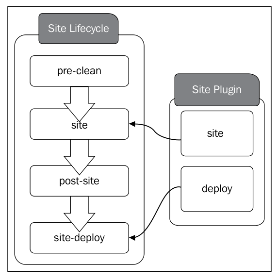

# Standard lifecyelss in Maven

!TOC

You cannot define **the same phase** in **two different lifecycles**.

The `plugin goal` to `lifecycle phase` **mapping** can be provided through **the application `POM` file**. If not, it will be inherited from **the super POM file**. The super POM file, which defines the
`clean` plugin by default, adds the plugin to the `clean` phase of the `clean` lifecycle.

## The clean lifecycle

!INCLUDE "clean-lifecycle-phases-short.mdpp"


### phase: `pre-clean` and `post-clean`

The objective of the `pre-clean` phase is to perform any operations prior to the cleaning task and the objective of the `post-clean` phase is to perform any operations after the cleaning task. 

> 两个phase的作用。

The `pre-clean` and `post-clean` phases of the `clean` lifecycle do not have any plugin bindings. 

> 两个phase没有任何plugin绑定。

If you need to associate any plugins with these two phases, you simply need to add them to the corresponding plugin configuration.

> 如果有需要，就使用它们两个phase。

我可以做一个播放音乐的功能，在开始之前播放一段音乐，在结束之后播放一段音乐。

## The default lifecycle

The `default` lifecycle in Maven defines **23 phases**. 

!INCLUDE "default-lifecycle-phases-short.mdpp"


> You cannot define **the same phase** in **two different lifecycles**.

When you run the command `mvn clean install`, it will execute all the phases from the `default` lifecycle up to and including the `install` phase. To be precise, Maven will first execute all the phases in `clean` lifecycle up to and including the `clean` phase, and will then execute the `default` lifecycle up to and including the `install` phase.

The following points summarize all the phases defined under the `default`
lifecycle in their order of execution:

!INCLUDE "default-lifecycle-phases-long.mdpp"

**The phases in the `default` lifecycle do not have any associated plugin goals**. The plugin bindings for each phase are defined by the corresponding packaging. If the
type of packaging of your Maven project is `JAR`, then it will define its own set of plugins for each phase. If the packaging type is `WAR`, then it will have its own set of plugins. 

The `packaging` type of a given Maven project is defined under the `<packaging>` element in the `pom.xml` file. If the element is omitted, then Maven assumes it as `jar` packaging.

```xml
<groupId>lsieun</groupId>
<artifactId>aegis</artifactId>
<version>1.0-SNAPSHOT</version>
<!-- packaging的默认值是jar。 -->
<packaging>jar</packaging>
```


```bash
mvn help:describe -Dcmd=deploy
```

## The site lifecycle

The `site` lifecycle is defined with four phases: `pre-site` , `site` , `post-site` , and `site-deploy` . 

- The site lifecycle
    - pre-site
    - site
    - post-site
    - site-deploy

The `site` lifecycle has no value without the Maven `site` plugin.

> 如果离开了site plugin，site lifecycle本身并没有多大的意义。  
> have no value，不是“没有参数值”，而是“没有价值、没有意义”。

> 上面是site lifecycle;  
> 下面是site plugin

The `site` plugin is used to generate static HTML content for a project. The generated HTML content will also include appropriate reports corresponding to the project.

The `site` plugin defines eight goals and two of them are directly associated with the phases in the `site` lifecycle.

```bash
mvn help:describe -Dcmd=site
```


