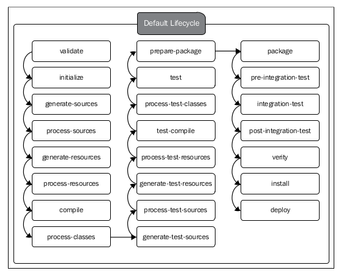

# Standard lifecycles in Maven

1\.  [The clean lifecycle](#thecleanlifecycle)  
1.1\.  [phase: `pre-clean` and `post-clean`](#phase:`pre-clean`and`post-clean`)  
2\.  [The default lifecycle](#thedefaultlifecycle)  
3\.  [The site lifecycle](#thesitelifecycle)  

Maven comes with three standard lifecycles: `default`, `clean`, and `site`. Each lifecycle defines its own set of phases. You cannot define **the same phase** in **two different lifecycles**.

> 这段理解三个意思：  
> （1）Maven提供了三种标准的生命周期：default、clean和site。  
> （2）每个lifecycle有自己的phase。  
> （3）在不同的lifecycle中，不能定义同名的phase。


<a name="thecleanlifecycle"></a>

## 1\. The clean lifecycle

The `clean` lifecycle defines three phases: `pre-clean` , `clean` , and `post-clean` .

- The clean lifecycle
    - pre-clean
    - clean
    - post-clean


<a name="phase:`pre-clean`and`post-clean`"></a>

### 1.1\. phase: `pre-clean` and `post-clean`

The objective of the `pre-clean` phase is to perform any operations prior to the cleaning task and the objective of the `post-clean` phase is to perform any operations after the cleaning task. 

> 两个phase的作用。

The `pre-clean` and `post-clean` phases of the `clean` lifecycle do not have any plugin bindings. 

> 两个phase没有任何plugin绑定。

If you need to associate any plugins with these two phases, you simply need to add them to the corresponding plugin configuration.

> 如果有需要，就使用它们两个phase。

我可以做一个播放音乐的功能，在开始之前播放一段音乐，在结束之后播放一段音乐。

<a name="thedefaultlifecycle"></a>

## 2\. The default lifecycle

The `default` lifecycle in Maven defines **23 phases**. 

- The default lifecycle
    - validate
    - --------------------
    - initialize
    - --------------------
    - generate-sources
    - process-sources
    - generate-resources
    - process-resources
    - **compile**
    - process-classes
    - --------------------
    - generate-test-sources
    - process-test-sources
    - generate-test-resources
    - process-test-resources
    - test-compile
    - process-test-classes
    - **test**
    - --------------------
    - prepare-package
    - **package**
    - pre-integration-test
    - integration-test
    - post-integration-test
    - verify
    - --------------------
    - **install**
    - --------------------
    - **deploy**
    - --------------------

> You cannot define **the same phase** in **two different lifecycles**.

When you run the command `mvn clean install`, it will execute all the phases from the `default` lifecycle up to and including the `install` phase. To be precise, Maven will first execute all the phases in `clean` lifecycle up to and including the `clean` phase, and will then execute the `default` lifecycle up to and including the `install` phase.

The following points summarize all the phases defined under the `default`
lifecycle in their order of execution:

- `validate` : This phase validates the project `POM` file and makes sure all the necessary information related to carry out the **build** is available.
- ------------------------
- `initialize` : This phase initializes **the build** by setting up the right directory structure and initializing properties.
- ------------------------
- `generate-sources` : This phase generates any required source code.
- `process-sources` : This phase processes the generated source code. For example, there can be a plugin running in this phase to filter the source code based on some defined criteria.
- `generate-resources` : This phase generates any resources that need to be packaged with the final artifact.
- `process-resources` : This phase processes the generated resources. It copies the resources to their  destination directories and makes them ready for packaging.
- `compile` : This phase compiles the source code.
- `process-classes` : This phase can be used to carry out any bytecode enhancements after the `compile` phase.
- ------------------------
- `generate-test-sources` : This phase generates the required source code for tests.
- `process-test-sources` : This phase processes the generated test source code. For example, there can be a plugin running in this phase to filter the source code based on some defined criteria.
- `generate-test-resources` : This phase generates all the resources required to run tests.
- `process-test-resources` : This phase processes the generated test resources. It copies the resources to their destination directories and makes them ready for testing.
- `test-compile` : This phase compiles the source code for tests.
- `process-test-classes` : This phase can be used to carry out any bytecode enhancements after the `test-compile` phase.
- `test` : This phase executes tests using the appropriate unit test framework.
- ------------------------
- `prepare-package` : This phase is useful in organizing the artifacts to be packaged.
- `package` : This phase packs the artifacts into a distributable format, for example, `JAR` or `WAR`.
- `pre-integration-test` : This phase performs the actions required (if any) before running integration tests. This may be used to start any external application servers and deploy the artifacts into different test environments.
- `integration-test` : This phase runs integration tests.
- `post-integration-test` : This phase can be used to perform any cleanup tasks after running the integration tests.
- `verify` : This phase verifies the validity of the package. The criteria to check the validity needs to be defined by the respective plugins.
- ------------------------
- `install` : This phase installs the final artifact in **the local repository**.
- ------------------------
- `deploy` : This phase deploys the final artifact to **a remote repository**.
- ------------------------
**The phases in the `default` lifecycle do not have any associated plugin goals**. The plugin bindings for each phase are defined by the corresponding packaging. If the
type of packaging of your Maven project is `JAR`, then it will define its own set of plugins for each phase. If the packaging type is `WAR`, then it will have its own set of plugins. 

The `packaging` type of a given Maven project is defined under the `<packaging>` element in the `pom.xml` file. If the element is omitted, then Maven assumes it as `jar` packaging.

```xml
<groupId>lsieun</groupId>
<artifactId>aegis</artifactId>
<version>1.0-SNAPSHOT</version>
<!-- packaging的默认值是jar。 -->
<packaging>jar</packaging>
```



```bash
mvn help:describe -Dcmd=deploy
```

<a name="thesitelifecycle"></a>

## 3\. The site lifecycle

The `site` lifecycle is defined with four phases: `pre-site` , `site` , `post-site` , and `site-deploy` . 

- The site lifecycle
    - pre-site
    - site
    - post-site
    - site-deploy

The `site` lifecycle has no value without the Maven `site` plugin.

> 如果离开了site plugin，site lifecycle本身并没有多大的意义。  
> have no value，不是“没有参数值”，而是“没有价值、没有意义”。

> 上面是site lifecycle;  
> 下面是site plugin


