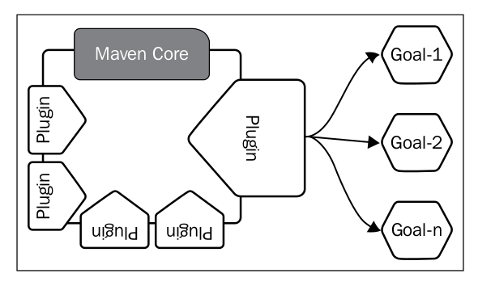

The beauty of Maven is its design. It does not try to do everything itself, but rather delegate the work to a plugin framework. When you download Maven from its website, it's only the core framework and plugins are downloaded on demand. All the useful functionalities in the build process are developed as Maven plugins. You can also easily call Maven **a plugin execution framework**.

