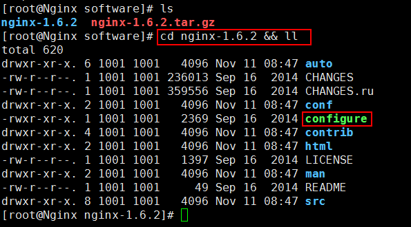
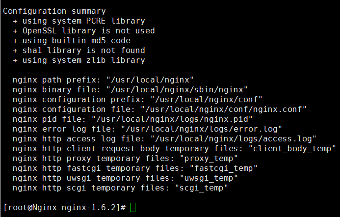
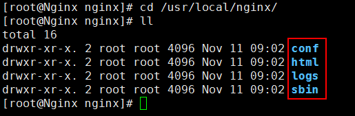
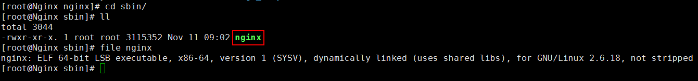
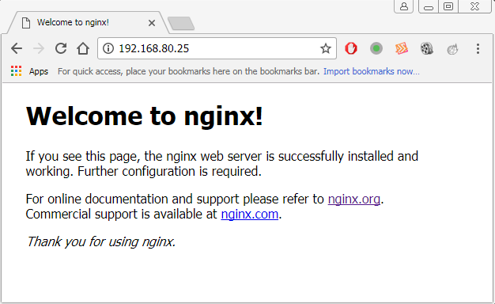

## 2、Nginx环境搭建##

### 2.1、安装依赖库 ###

安装Nginx所需要的依赖库

	yum -y install pcre
	yum -y install pcre-devel
	yum -y install zlib
	yum -y install zlib-devel

### 2.2、下载和解压 ###

Nginx下载地址：

	http://nginx.org/

解压命令：

	mkdir -p /usr/local/software
	cd /usr/local/software/
	tar -zxvf nginx-1.6.2.tar.gz
	

### 2.3、配置 ###

切换到`nginx-1.6.2`目录

	cd nginx-1.6.2 && ll

使用configure进行配置

	./configure --prefix=/usr/local/nginx 

查看是否有报错信息

### 2.4、编译和安装 ###

>注意：当前是第4步（编译和安装），位于`/usr/local/software/nginx-1.6.2`目录下

编译

	make

安装	

	make install

编译和安装也可以一起执行

	make && make install

### 2.5、Nginx目录和命令 ###

安装完成后，切换到安装目录`/usr/local/nginx/`：

	cd /usr/local/nginx/

查看目录下的内容，有4个目录：

	conf：存放配置文件
	html：存放网页文件
	logs：存放日志文件
	sbin：主要存放二进制程序（目录只有一个nginx文件）

Nginx命令：

	#启动
	/usr/local/nginx/sbin/nginx

	#关闭
	/usr/local/nginx/sbin/nginx -s stop

	#重启
	/usr/local/nginx/sbin/nginx -s reload

### 2.6、使用Nginx ###

首先，启动Nginx

	/usr/local/nginx/sbin/nginx

然后，验证是否启动成功：

	#第一种方法：
	netstat -nltp | grep nginx

	#第二种方法：
	ps -ef | grep nginx

如果启动失败，则可能是80端口被占用。
	

验证Nginx是否启动成功，也可以通过浏览器访问：

	http://192.168.80.25:80/

如果通过浏览访问不成功，可能是防火墙没有关闭

	#关闭防火墙
	service iptables stop

最后，关闭Nginx

	/usr/local/nginx/sbin/nginx -s stop

