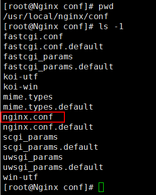

## 3、Nginx配置文件说明 ##

Nginx最重要的配置文件就是`$NGINX_HOME/conf/nginx.conf`文件。

在本文当中，Nginx的安装目录位于`/usr/local/nginx`，`nginx.conf`的完整路径为`/usr/local/nginx/conf/nginx.conf`。

这里主要围绕`nginx.conf`来进行讲解，即通过对nginx.conf的配置来达到不同的效果：

- Nginx虚拟主机配置
- Nginx日志管理
- location讲解
- 反向代理
- 负载均衡