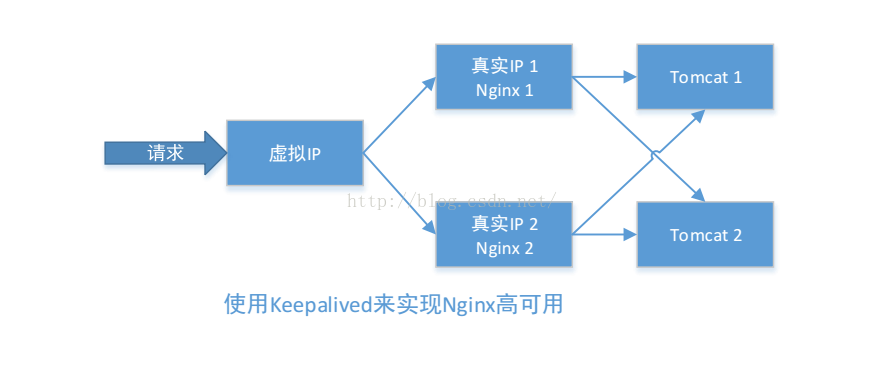
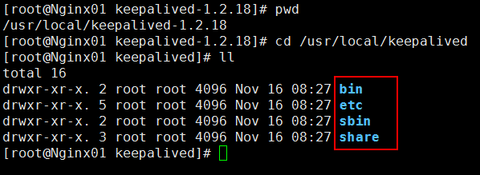

# Nginx+Keepalived实用高可用 #

http://blog.csdn.net/u012453843/article/details/69668663

http://blog.csdn.net/u012453843/article/category/6929956

首先介绍一下Keepalived，它是一个高性能的服务器，高可用或热血解决方案。Keepalived主要来防止服务器单点故障的发生问题，可能通过其与Nginx的配置实现Web服务端的高可用。

Keepalived以VRRP协议为实现基础，用VRRP协议来实现高可用性（HA）。VRRP（Virtual Router Redundancy Protocol）协议是用于实现路由器冗余的协议，VRRP协议将两台或多台路由器设备虚拟成一个设备，对外提供虚拟路由器IP（一个或多个）。

高可用：只有一个节点对外提供服务，当这个节点出现问题的时候，才会切换到另外的节点上。

keepalived + Nginx

当一个Nginx出现问题的时候，才切换到另外一个Nginx上。

安装Keepalived

下载Keepalived地址：http://www.keepalived.org/download.html

需要依赖的软件包

	yum install -y openssl openssl-devel

解压安装： 

	cd /usr/local/software/
	tar -zxvf keepalived-1.2.18.tar.gz -C /usr/local/

切换到keepalived的解压目录，进行配置

	cd /usr/local/keepalived-1.2.18/ && ./configure --prefix=/usr/local/keepalived

编译和安装

	make && make install

切换到keepalived的安装目录，查看内容

	cd /usr/local/keepalived && ll

将keepalived安装成Linux系统服务，因为没有使用keepalived的默认安装路径（默认安装路径：/usr/local），安装完成之后，需要做一些修改：

首先，创建文件夹，将keepalived配置文件进行复制

	mkdir /etc/keepalived
	cp /usr/local/keepalived/etc/keepalived/keepalived.conf /etc/keepalived/

然后复制keepalived脚本文件

	cp /usr/local/keepalived/etc/rc.d/init.d/keepalived /etc/init.d/
	cp /usr/local/keepalived/etc/sysconfig/keepalived /etc/sysconfig/

创建软连接

	ln -s /usr/local/keepalived/sbin/keepalived /usr/sbin/
	ln -s /usr/local/keepalived/sbin/keepalived /sbin/

可以设置开机启动

	chkconfig keepalived on

至此，keepalived安装完毕。

启动keepalived服务

	service keepalived start

	service keepalived stop
	service keepalived restart

查看keepalived进程

	ps -ef | grep keepalived

keepalived配置文件说明

对配置文件进行修改

	vi /etc/keepalived/keepalived.conf

参考文档：keepalived配置手册
参考文章：http://blog.csdn.net/jibcy/article/details/7826158
配置完成以后，我们先启动两个服务器nginx，然后我们再启动两个服务器的keepalived。使用service keepalived start(stop停止)，然后输入命令： ip a 查看后会发现多了一个虚拟ip（VIP地址）

我们进行两个简单测试
1、关闭keepalived进行测试
2、手动修改Nginx配置文件，让其变得不能使用，然后kill掉nginx进程。进行测试。

主节点192.168.80.21

	! Configuration File for keepalived
	
	bal_defs {
	   router_id 192.168.80.21
	}
	
	vrrp_script chk_nginx {
	   script "/etc/keepalived/nginx_check.sh"
	   interval 2
	   weight -20
	}
	
	vrrp_instance VI_1 {
	    state MASTER
	    interface eth0
	    virtual_router_id 20 #这两个地方应该写成一致，而且只能是数字
	    mcast_src_ip 192.168.80.21
	    priority 100
	    nopreempt
	    advert_int 1
	    authentication {
	        auth_type PASS
	        auth_pass 1111
	    }
	    track_script {
	       chk_nginx
	    }
	    virtual_ipaddress {
	        192.168.80.20
	    }
	}

BACKUP

	! Configuration File for keepalived
	
	bal_defs {  
	   router_id 192.168.80.22  
	}  
	  
	vrrp_script chk_nginx {  
	   script "/etc/keepalived/nginx_check.sh"  
	   interval 2  
	   weight -20  
	}  
	  
	vrrp_instance VI_1 {  
	    state BACKUP  
	    interface eth0  
	    virtual_router_id 20 
	    mcast_src_ip 192.168.80.22  
	    priority 90  
	    nopreempt  
	    advert_int 1  
	    authentication {  
	        auth_type PASS  
	        auth_pass 1111  
	    }  
	    track_script {  
	       chk_nginx  
	    }  
	    virtual_ipaddress {  
	        192.168.80.20  
	    }  
	}  

>注意：virtual_router_id 取值在0-255之间，用来区分多个instance的VRRP组播。
>priority 用来选举master的，要成为master，那么这个选项的值最好高于其他机器50个点，该项取值范围是1-255（在此范围之外会被识别成默认值100）。
>advert_int 发VRRP包的时间间隔，即多久进行一次master选举（可以认为是健康查检时间间隔）。

vi nginx_check.sh

	#!/bin/sh
	A=`ps -C nginx --no-header |wc -l`
	if [ $A -eq 0 ];then
	    /usr/local/nginx/sbin/nginx
	    sleep 2
	    if [ `ps -C nginx --no-header |wc -l` -eq 0 ];then
	        killall keepalived
	    fi
	fi

chmod 777 nginx_check.sh

ip -a 查看两台电脑的IP地址

