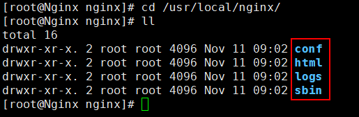
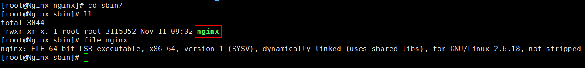
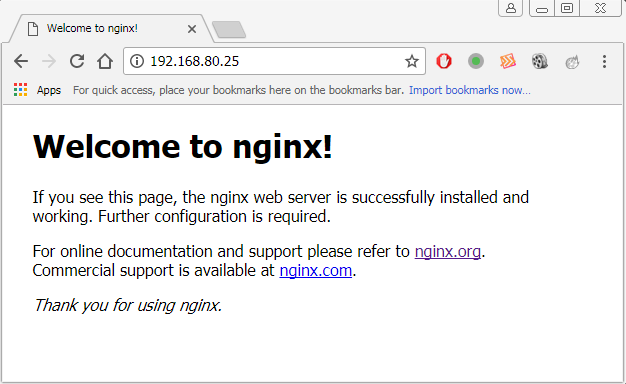
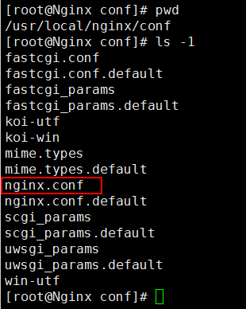
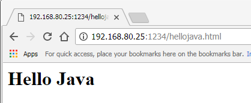

# Nginx #

## 1、Nginx简介 ##

### 1.1、Nginx概述 ###

Nginx是一款轻量级的Web服务器/反向代理服务器及电子邮件(IMAP/POP3)代理服务器，并在一个BSD-like协议下发行。由俄罗斯的程序设计师Igor Sysoev所开发，供俄国大型的入口网站及搜索引擎Rambler使用。其特点是占有内存少，并发能力强，事实上Nginx的并发能力确实在同类型的网页服务器中表现较好，中国大陆使用Nginx网站用户有：百度、新浪、网易、腾讯等。

### 1.2、负载均衡策略 ###

1. 使用硬件复杂均衡策略实现，如使用F5、Array等负载均衡器
2. 使用软件进行负载均衡
	- 如使用阿里云服务器均衡负载SLB
	- 使用Nginx+Keeplived
	- 其他软件负载均衡LVS(Linux Virtual Server)、haproxy等技术

### 1.3、Nginx优点 ###

Nginx可以在大多数Unix like OS上编译运行，并有Windows移植版。Nginx的1.4.0稳定版已经于2013年4月24日发布，一般情况下，对于新建站点，建议使用最新稳定版作为生产版本，已有站点的升级急迫性不高。Nginx的源代码使用2-clause BSD-like license。

Nginx是一个很强大的高性能Web和反向代理服务器，它具有很多非常优越的特性。

在高连接并发的情况下，Nginx是Apache服务器不错的替代品：Nginx在美国是做虚拟主机生意的老板们经常选择的软件平台之一。能够支持高达50,000个并发连接数的响应，感谢Nginx为我们选择了epoll and kqueue作为开发模型。

## 2、Nginx环境搭建##

### 2.1、下载和解压 ###

Nginx下载地址：

	http://nginx.org/

解压命令：

	mkdir -p /usr/local/software
	cd /usr/local/software/
	tar -zxvf nginx-1.6.2.tar.gz
	
### 2.2、安装依赖库 ###

安装Nginx所需要的依赖库

	yum -y install pcre
	yum -y install pcre-devel
	yum -y install zlib
	yum -y install zlib-devel

### 2.3、配置 ###

切换到`nginx-1.6.2`目录

	cd nginx-1.6.2 && ll

使用configure进行配置

	./configure --prefix=/usr/local/nginx 

查看是否有报错信息

### 2.4、编译和安装 ###

>注意：当前是第4步（编译和安装），位于`/usr/local/software/nginx-1.6.2`目录下

编译

	make

安装	

	make install

编译和安装也可以一起执行

	make && make install

### 2.5、Nginx目录和命令 ###

安装完成后，切换到安装目录`/usr/local/nginx/`：

	cd /usr/local/nginx/

查看目录下的内容，有4个目录：

	conf：存放配置文件
	html：存放网页文件
	logs：存放日志文件
	sbin：主要存放二进制程序（目录只有一个nginx文件）

Nginx命令：

	#启动
	/usr/local/nginx/sbin/nginx

	#关闭
	/usr/local/nginx/sbin/nginx -s stop

	#重启
	/usr/local/nginx/sbin/nginx -s reload

### 2.6、使用Nginx ###

首先，启动Nginx

	/usr/local/nginx/sbin/nginx

然后，验证是否启动成功：

	#第一种方法：
	netstat -nltp | grep nginx

	#第二种方法：
	ps -ef | grep nginx

如果启动失败，则可能是80端口被占用。
	

验证Nginx是否启动成功，也可以通过浏览器访问：

	http://192.168.80.25:80/

如果通过浏览访问不成功，可能是防火墙没有关闭

	#关闭防火墙
	service iptables stop

最后，关闭Nginx

	/usr/local/nginx/sbin/nginx -s stop

## 3、Nginx配置文件说明 ##

Nginx最重要的配置文件就是`$NGINX_HOME/conf/nginx.conf`文件。

在本文当中，Nginx的安装目录位于`/usr/local/nginx`，`nginx.conf`的完整路径为`/usr/local/nginx/conf/nginx.conf`。

这里主要围绕`nginx.conf`来进行讲解，即通过对nginx.conf的配置来达到不同的效果：

- Nginx虚拟主机配置
- Nginx日志管理
- location讲解
- 反向代理
- 负载均衡

## 4、Nginx虚拟主机配置 ##

### 4.1、添加虚拟主机配置 ###

修改nginx.conf文件

	vi /usr/local/nginx/conf/nginx.conf

添加如下内容：

    server {
        listen      1234;
        server_name lsieun.com;
        location / {
            root  lsieun.com;
            index index.html;
        }
    }

完整nginx.conf文件（已经删除一些注释的部分）内容如下：

	#user  nobody;
	worker_processes  1;
	
	#error_log  logs/error.log;
	#error_log  logs/error.log  notice;
	#error_log  logs/error.log  info;
	
	#pid        logs/nginx.pid;
	
	
	events {
	    worker_connections  1024;
	}
	
	
	http {
	    include       mime.types;
	    default_type  application/octet-stream;
	
	    #log_format  main  '$remote_addr - $remote_user [$time_local] "$request" '
	    #                  '$status $body_bytes_sent "$http_referer" '
	    #                  '"$http_user_agent" "$http_x_forwarded_for"';
	
	    #access_log  logs/access.log  main;
	
	    sendfile        on;
	    #tcp_nopush     on;
	
	    #keepalive_timeout  0;
	    keepalive_timeout  65;
	
	    server {
	        listen       80;
	        server_name  localhost;
	
	        location / {
	            root   html;
	            index  index.html index.htm;
	        }
	
	        error_page   500 502 503 504  /50x.html;
	        location = /50x.html {
	            root   html;
	        }
	
	    }
	
	    server {
	        listen      1234;
	        server_name lsieun.com;
	        location / {
	            root  lsieun.com;
	            index index.html;
	        }
	    }
	
	}

### 4.2、添加虚拟主机的目录和文件 ###

在`/usr/local/nginx`目录下添加`lsieun.com`目录

	cd /usr/local/nginx/
	mkdir lsieun.com

切换到`lsieun.com`目录下，添加`index.html`文件

	cd lsieun.com/
	vi index.html

添加内容如下：

	<html>
	<head>
	    <title>lsieun.com</title>
	</head>
	<body>
	    <h1>Hello World, This is lsieun.com!</h1>
	</body>
	</html>

### 4.3、启动Nginx ###

如果没有启动Nginx，使用如下命令启动Nginx：

	/usr/local/nginx/sbin/nginx

如果已经启动Nginx，可以通过以下命令重新加载nginx.conf文件

	/usr/local/nginx/sbin/nginx -s reload

### 4.4、浏览器访问 ###

在浏览器中进行访问，输入以下地址：

	http://192.168.80.25:1234/

## 5、Nginx日志管理 ##

默认情况下，Nginx访问日志放在logs/access.log内，并且使用main格式（还可以自定义格式）。

对于main格式，它是定义在nginx.conf文件内（默认是注释掉的），具体定义如下：

    #日志文件输出格式 这个位置相当于全局设置
    #log_format  main  '$remote_addr - $remote_user [$time_local] "$request" '
    #                  '$status $body_bytes_sent "$http_referer" '
    #                  '"$http_user_agent" "$http_x_forwarded_for"';

每当刷新一下浏览器的页面里，access.log文件内就会添加新的记录，查看日志内容的命令如下：

	tail -f /usr/local/nginx/logs/access.log

在日常工作中，对Nginx日志的分析非常重要，通常需要运维去对Nginx的日志进行切割和分析处理。比如实现一个定时任务，去处理Nginx日志等。

第一步：配置Nginx的日志输出，修改nginx.conf文件。
第二步：分析如何去实现日志切分，编写shell脚本。
第三步：定时任务对脚本进行调度： ctrontab -e

### 5.1、配置Nginx的日志输出 ###

修改nginx.conf文件

	vi /usr/local/nginx/conf/nginx.conf

（1）取消对`log_format main`的注释

（2）取消对全局`access_log`的注释

（3）为`lsieun.com`虚拟主机添加`access_log`

（4）修改完成后，重新加载nginx.conf配置文件

	/usr/local/nginx/sbin/nginx -s reload

完整nginx.conf文件内容如下：

	
	#user  nobody;
	worker_processes  1;
	
	#error_log  logs/error.log;
	#error_log  logs/error.log  notice;
	#error_log  logs/error.log  info;
	
	#pid        logs/nginx.pid;
	
	
	events {
	    worker_connections  1024;
	}
	
	
	http {
	    include       mime.types;
	    default_type  application/octet-stream;
	
	    log_format  main  '$remote_addr - $remote_user [$time_local] "$request" '
	                      '$status $body_bytes_sent "$http_referer" '
	                      '"$http_user_agent" "$http_x_forwarded_for"';
	
	    access_log  logs/access.log  main;
	
	    sendfile        on;
	    #tcp_nopush     on;
	
	    #keepalive_timeout  0;
	    keepalive_timeout  65;
	
	    #gzip  on;
	
	    server {
	        listen       80;
	        server_name  localhost;
	
	        #charset koi8-r;
	
	        #access_log  logs/host.access.log  main;
	
	        location / {
	            root   html;
	            index  index.html index.htm;
	        }
	
	        #error_page  404              /404.html;
	
	        # redirect server error pages to the static page /50x.html
	        #
	        error_page   500 502 503 504  /50x.html;
	        location = /50x.html {
	            root   html;
	        }
	
	    }
	
	    server {
	        listen      1234;
	        server_name lsieun.com;
	        access_log  logs/lsieun.com.access.log  main;
	        location / {
	            root  lsieun.com;
	            index index.html;
	        }
	    }
	
	}

### 5.2、分析如何去实现日志切分 ###

（1）编写shell脚本。

在`usr/local/nginx/sbin/`目录下添加`log.sh`文件:

	cd /usr/local/nginx/sbin/
	vi log.sh

`log.sh`文件内容如下：

	#!/bin/sh
	
	NGINX_HOME=/usr/local/nginx
	BASE_FILE_NAME=lsieun.com.access.log
	
	CURRENT_PATH=$NGINX_HOME/logs
	CURRENT_FILE=$CURRENT_PATH/$BASE_FILE_NAME
	
	BAK_PATH=$NGINX_HOME/datalogs
	BAK_TIME=`/bin/date -d yesterday +%Y%m%d%H%M`
	BAK_FILE=$BAK_PATH/$BAK_TIME-$BASE_FILE_NAME
	
	echo $BAK_FILE
	
	$NGINX_HOME/sbin/nginx -s stop
	
	mv $CURRENT_FILE $BAK_FILE
	
	$NGINX_HOME/sbin/nginx

（2）创建datalogs目录

	mkdir -p /usr/local/nginx/datalogs

（3）测试运行脚本

	sh /usr/local/nginx/sbin/log.sh

### 5.3、编写定时任务 ###

对脚本进行定时任务调度： 

	crontab -e

文件内添加如下内容：

	*/1 * * * * sh /usr/local/nginx/sbin/log.sh

如果想取消定时任务，只要将这行内容删掉即可。

## 6、Nginx location匹配规则 ##

location语法：表示uri方式定位

基础语法有三种：

	location = pattern {} 精准匹配
	location pattern {} 一般匹配
	location ~pattern {} 正则匹配

Nginx语法

if(条件为： = ~ ~*)、return、break、rewrite
-f 是否为文件、-d 是否为目录 -e是否存在

location匹配命令

~      #波浪线表示执行一个正则匹配，区分大小写
~*    #表示执行一个正则匹配，不区分大小写
^~    #^~表示普通字符匹配，如果该选项匹配，只匹配该选项，不匹配别的选项，一般用来匹配目录
=      #进行普通字符精确匹配
@     #"@" 定义一个命名的 location，使用在内部定向时，例如 error_page, try_files

location 匹配的优先级(与location在配置文件中的顺序无关)
= 精确匹配会第一个被处理。如果发现精确匹配，nginx停止搜索其他匹配。
普通字符匹配，正则表达式规则和长的块规则将被优先和查询匹配，也就是说如果该项匹配还需去看有没有正则表达式匹配和更长的匹配。
^~ 则只匹配该规则，nginx停止搜索其他匹配，否则nginx会继续处理其他location指令。
最后匹配理带有"~"和"~*"的指令，如果找到相应的匹配，则nginx停止搜索其他匹配；当没有正则表达式或者没有正则表达式被匹配的情况下，那么匹配程度最高的逐字匹配指令会被使用。

location 优先级官方文档

Directives with the = prefix that match the query exactly. If found, searching stops.
All remaining directives with conventional strings, longest match first. If this match used the ^~ prefix, searching stops.
Regular expressions, in order of definition in the configuration file.
If #3 yielded a match, that result is used. Else the match from #2 is used.
=前缀的指令严格匹配这个查询。如果找到，停止搜索。
所有剩下的常规字符串，最长的匹配。如果这个匹配使用^〜前缀，搜索停止。
正则表达式，在配置文件中定义的顺序。
如果第3条规则产生匹配的话，结果被使用。否则，使用第2条规则的结果。

	location  = / {
	  # 只匹配"/".
	  [ configuration A ] 
	}
	location  / {
	  # 匹配任何请求，因为所有请求都是以"/"开始
	  # 但是更长字符匹配或者正则表达式匹配会优先匹配
	  [ configuration B ] 
	}
	location ^~ /images/ {
	  # 匹配任何以 /images/ 开始的请求，并停止匹配 其它location
	  [ configuration C ] 
	}
	location ~* .(gif|jpg|jpeg)$ {
	  # 匹配以 gif, jpg, or jpeg结尾的请求. 
	  # 但是所有 /images/ 目录的请求将由 [Configuration C]处理.   
	  [ configuration D ] 
	}

ngixn可以对数据进行压缩，对一些图片、html、css、js等文件进行缓存，从而实现动静分离等等优化功能，在网站做优化的时候非常的有用。

### 配置location = /404.html ###

修改nginx.conf文件

	vi /usr/local/nginx/conf/nginx.conf

添加精准匹配的规则

        error_page 404    /404.html;
        location = /404.html {
            root   lsieun.com/error/;
        }

重新加载nginx.conf文件

	/usr/local/nginx/sbin/nginx -s reload

添加目录和文件

	cd lsieun.com/
	mkdir error
	cd error/
	vi 404.html

`404.html`文件内容如下：

	<html>
	<head>
	    <title>404</title>
	</head>
	<body>
	    <h1>Page Not Found!!!</h1>
	</body>
	</html>

### 配置location /hello ###

修改nginx.conf文件

	vi /usr/local/nginx/conf/nginx.conf

添加匹配的规则

        location /hello {
            root  lsieun.com/hello/;
        }

重新加载nginx.conf配置

	/usr/local/nginx/sbin/nginx -s reload

在`/usr/local/nginx/lsieun.com/`添加`hello`目录，在hello目录下添加helloworld.html和hellojava.html文件。

	
helloworld.html内容如下：

	<h1>Hello World</h1>

hellojava.html内容如下：

	<h1>Hello Java</h1>
	

使用浏览器进行浏览

### location /goods ###

修改nginx.conf文件

	vi /usr/local/nginx/conf/nginx.conf

添加如下内容：

        location /goods {
            rewrite "goods-(\d{1,5}).html" /goods-ctrl.html;
            root lsieun.com/goods/;
        }

在`/usr/local/nginx/lsieun.com/`目录下添加`goods`目录，在`goods`目录下添加goods-ctrl.html。

在浏览器中访问：

### location ~ test ###

修改nginx.conf文件

	vi /usr/local/nginx/conf/nginx.conf

添加如下内容：

        location ~ test {
            #注意if与()之间要有空格
            if ($remote_addr = 192.168.80.1){
                return 401;
            }
            root lsieun.com/test/;
        }

重新加载nginx.conf文件

	/usr/local/nginx/sbin/nginx -s reload

在`/usr/local/nginx/lsieun.com/`目录下添加`test`目录，在`test`目录中添加test123.html文件。

在浏览器中进行访问

重新修改nginx.conf文件

        location ~ test {
            #if ($remote_addr = 192.168.80.1){
            #    return 401;
            #}
            if ($http_user_agent ~* chrome){
                rewrite ^.*$ /chrome.html;
                break;
            }
            root lsieun.com/test/;
        }

重新加载nginx.conf文件

	/usr/local/nginx/sbin/nginx -s reload

在`/usr/local/nginx/lsieun.com/`目录下添加`test`目录，在`test`目录中添加chrome.html文件。

在浏览器中进行访问

>注意：在使用IE浏览器时，要输入完整的地址（包括前缀http://)，如果输入不完整，IE浏览器会找不到页面。

### location ^~ /images/ ###

修改nginx.conf文件

	vi /usr/local/nginx/conf/nginx.conf

添加如下内容：

        location ^~ /images/ {
            root lsieun.com/files/;
        }

重新加载nginx.conf文件

	/usr/local/nginx/sbin/nginx -s reload

在`/usr/local/nginx/lsieun.com/`目录下添加`files/images`目录，在`files/images`目录下添加beauty.jpg文件。然后，使用浏览器进行访问

### location ~* .(gif|jpg)$ ###

修改nginx.conf文件

	vi /usr/local/nginx/conf/nginx.conf

添加内容如下：

        location ~* .(gif|jpg)$ {
            root lsieun.com/pictures/;
        }

在`/usr/local/nginx/lsieun.com`目录下添加`pictures`添加jerry.jpg文件

在浏览器中进行访问

## 7、Nginx配置反向代理 ##

修改nginx.conf文件

	vi /usr/local/nginx/conf/nginx.conf

添加内容如下：

        #配置反向代理tomcat服务器：拦截.jsp结尾的请求转向到tomcat
        location ~ \.jsp$ {
            proxy_pass http://192.168.80.26:8080;
        }

重新加载nginx.conf文件

	/usr/local/nginx/sbin/nginx -s reload

>注意：在以上操作是在192.168.80.25机器上进行，以下配置在192.168.80.26上进行。

在192.168.80.26机器上安装jdk和tomcat

创建/usr/local/software目录上传jdk和tomcat的tar.gz文件

	mkdir -p /usr/local/software
	cd /usr/local/software/

解压jdk

	tar -zxvf jdk-7u79-linux-x64.tar.gz -C /usr/local/

创建jdk的软连接

	cd /usr/local/
	ln -s jdk1.7.0_79/ jdk

修改`/etc/profile`文件

	vi /etc/profile

在文件尾部添加如下内容：

	JAVA_HOME=/usr/local/jdk
	export PATH=${JAVA_HOME}/bin:$PATH

重新加载/etc/profile文件

	source /etc/profile

验证jdk是否安装成功

	java -version

解压tomcat

	tar -zxvf apache-tomcat-7.0.72.tar.gz -C /usr/local/

创建tomcat的软连接

	cd /usr/local/
	ln -s apache-tomcat-7.0.72/ tomcat

关闭防火墙

	service iptables stop

启动Tomcat

	/usr/local/tomcat/bin/startup.sh

打开浏览器

## 8、负载均衡 ##

## Nginx配置文件说明：反向代理与负载均衡 ##

Nginx反向代理 proxy 与负载均衡 upstream

配置反向代理proxy: proxy_pass url地址

配置负载均衡upstream: upstream

官方配置： http://nginx.org/en/docs

注意：反向代理之后获取客户端IP地址为nginx服务器地址，这里需要进行forward，设置真实的IP地址

	#设置客户端真实IP地址
	proxy_set_header X-real-ip $remote_addr

在MyTomcat01（192.168.80.26）上添加test.jsp内容如下：

	<%@ page language="java" contentType="text/html; charset=UTF-8" pageEncoding="UTF-8"%>
	<!DOCTYPE html PUBLIC "-//W3C//DTD HTML 4.01 Transitional//EN" "http://www.w3.org/TR/html4/loose.dtd">
	<html>
	<head>
	<meta http-equiv="Content-Type" content="text/html; charset=UTF-8">
	<title>Test Page</title>
	</head>
	<body>
	<h1>MyTomcat01 Test!!!</h1> 
	remote ip :  <%=request.getHeader("X-real-ip") %>  
	nginx server ip : <%=request.getRemoteAddr()%>
	</body>
	</html>

在MyTomcat02（192.168.80.27）上添加test.jsp内容如下：

	<%@ page language="java" contentType="text/html; charset=UTF-8" pageEncoding="UTF-8"%>
	<!DOCTYPE html PUBLIC "-//W3C//DTD HTML 4.01 Transitional//EN" "http://www.w3.org/TR/html4/loose.dtd">
	<html>
	<head>
	<meta http-equiv="Content-Type" content="text/html; charset=UTF-8">
	<title>Test Page</title>
	</head>
	<body>
	<h1>MyTomcat02 Test!!!</h1> 
	remote ip :  <%=request.getHeader("X-real-ip") %>  
	nginx server ip : <%=request.getRemoteAddr()%>
	</body>
	</html>

在25机器上修改nginx.conf文件

	vi /usr/local/nginx/conf/nginx.conf

添加如下内容：

    upstream web_project {
        server 192.168.80.26:8080 weight=1 max_fails=2 fail_timeout=30s;
        server 192.168.80.27:8080 weight=1 max_fails=2 fail_timeout=30s;
    }

        location / {
            #设置客户端真实ip地址
            proxy_set_header X-real-ip $remote_addr;
            #负载均衡反向代理
            proxy_pass http://web_project;
            root   html;
            index  index.html index.htm;
        }

重新加载nginx.conf的配置

	/usr/local/nginx/sbin/nginx -s reload

使用浏览器进行查看

>至此结束

