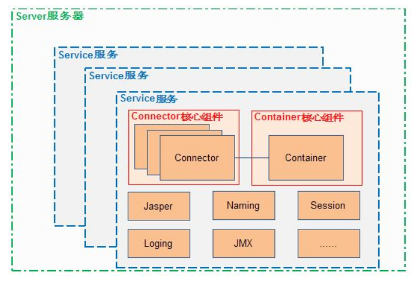

# 深入理解Tomcat #

[深入理解Tomcat](https://blog.csdn.net/column/details/understand-tomcat.html)

## Tomcat系统架构和核心组件 ##

首先我们从一个宏观的角度来看一下Tomcat的系统的架构：

从这张图中可以看到，

- Tomcat的**核心组件**就两个：`Connector`和`Container`。
- 一个`Connector`+一个`Container`构成一个`Service`，`Service`就是对外提供服务的组件，有了`Service`组件Tomcat就可以对外提供服务了。
- 但是光有服务还不行，还得有环境让你提供服务才行，所以最外层的`Server`就为`Service`提供了生存的土壤。

那么这些个组件到底是干嘛用的呢？

`Connector`是一个连接器，主要负责接收请求并把请求交给`Container`。
`Container`就是一个容器，主要装的是具体处理请求的组件。
`Service`主要是为了关联`Container`与`Connector`，一个单独的Container或者一个单独的Connector都不能完整处理一个请求，只有两个结合在一起才能完成一个请求的处理。
`Server`这是负责管理Service集合，从图中我们看到一个Tomcat可以提供多种服务，那么这些`Serice`就是由`Server`来管理的，具体的工作包括：对外提供一个接口访问Service，对内维护Service集合；维护Service集合又包括管理Service的生命周期、寻找一个请求的Service、结束一个Service等。

以上就是对Tomcat的核心组件的简要说明。

## Connector ##

Connector是Tomcat的连接器，其主要任务是负责处理浏览器发送过来的请求，并创建一个Request和Response的对象用于和浏览器交换数据，然后产生一个线程用于处理请求，Connector会把Request和Response对象传递给该线程，该线程的具体的处理过程是Container容器的事了。

## Container ##

上面说到Connector把封装了Request对象以及Response对象的Socket传递给了Container容器，那么在`Contianer`容器中又是怎么样的处理流程呢？

在说Container容器之前，有必要对Container容器有一个简单的了解，`Container`容器是子容器的父接口，所有的子容器都必须实现这个接口，在Tomcat中Container容器的设计是典型的**责任链设计模式**，其有四个子容器：`Engine`、`Host`、`Context`和`Wrapper`。这四个容器之间是**父子关系**，Engine容器包含Host，Host包含Context，Context包含Wrapper。 

我们在web项目中的一个Servlet类对应一个Wrapper，多个Servlet就对应多个Wrapper，当有多个Wrapper的时候就需要一个容器来管理这些Wrapper了，这就是`Context`容器了，Context容器对应一个工程，所以我们新部署一个工程到Tomcat中就会新创建一个Context容器。

> 这一段是讲Wrapper和Context容器。

Engine容器包含Host容器，可以知道其管理的容器是Host，Engine是一个接口，其标准实现类是StandardEngine。

> 这一段是讲Engine容器。

Host容器是Engine容器的子容器，上面也说到Host是受Engine容器管理的，就是指一个虚拟主机，比如我们在访问具体jsp页面URL中localhost就是一个虚拟主机，其作用是运行多个应用，并对这些应用进行管理，其子容器是Context，而且一个主机还保存了主机的相关信息。Host的标准实现类是StandardHost，其闸门实现是StandardHostValve

> 这一段是讲Host容器。

Context容器是一个Web项目的代表，主要管理Servlet实例，在Tomcat中Servlet实例是以Wrapper出现的，现在问题是如何才能通过Context容器找到具体的Servlet呢？在解决这个问题之前，Context容器需要先启动，启动的过程就是加载个类资源文件以及打开子容器以及Pipeline管道的过程。启动Context容器后，就可以处理具体的请求了，具体是通过Request对象，从代码清单4-3的`Wrapper wrapper = request.getWrapper()`就可以看出来。 

那么Context调用invoke方法后又发生什么了呢？具体执行的是org.apache.catalina.core.StandardContextValve的invoke方法。相当于进入了Context管道中，要开始通过管道中一个个闸门了。 

Wrapper容器负责管理一个Servlet，包括Servlet的装载、初始化、资源回收。Wrapper是最底层的容器，其不能在添加子容器了。Wrapper是一个接口，其标准实现类是StandardWrapper

> 这一段是讲Wrapper容器。

