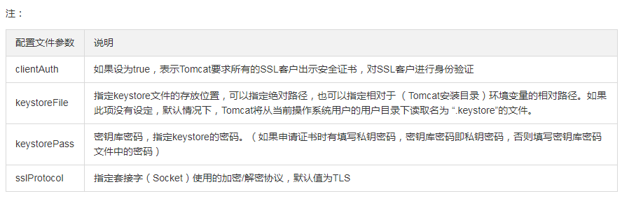

# Tomcat 证书部署 #

[证书安装指引](Tomcat 证书部署)

## 1、获取证书 ##

如果申请证书时有填写私钥密码，下载可获得Tomcat文件夹，其中有密钥库 www.domain.com.jks；  
如果没有填写私钥密码，证书下载包的Tomcat文件夹中包括密钥库文件www.domain.com.jks 与密钥库密码文件keystorePass.txt  
当用户选择粘贴CSR时，不提供Tomcat证书文件的下载，需要用户手动转换格式生成,操作方法如下：  

> 可以通过 Nginx 文件夹内证书文件和私钥文件生成jks格式证书
> 转换工具：https://www.trustasia.com/tools/cert-converter.htm
> 使用工具时注意填写 密钥库密码 ，安装证书时配置文件中需要填写。

## 2、证书安装 ##
配置SSL连接器，将`www.domain.com.jks`文件存放到`conf`目录下，然后配置同目录下的`server.xml`文件：

```xml
<Connector port="443" protocol="HTTP/1.1" SSLEnabled="true"
    maxThreads="150" scheme="https" secure="true"
    keystoreFile="conf/www.domain.com.jks"
    keystorePass="changeit"
    clientAuth="false" sslProtocol="TLS" />
```



## 3、http自动跳转https的安全配置 ##

到`conf`目录下的`web.xml`。在`</welcome-file-list>`后面，`</web-app>`，也就是倒数第二段里，加上这样一段

```xml
    <login-config>
        <!-- Authorization setting for SSL -->
        <auth-method>CLIENT-CERT</auth-method>
        <realm-name>Client Cert Users-only Area</realm-name>
    </login-config>
    <security-constraint>
        <!-- Authorization setting for SSL -->
        <web-resource-collection>
            <web-resource-name>SSL</web-resource-name>
            <url-pattern>/*</url-pattern>
        </web-resource-collection>
        <user-data-constraint>
            <transport-guarantee>CONFIDENTIAL</transport-guarantee>
        </user-data-constraint>
    </security-constraint>
```

这步目的是让非ssl的connector跳转到ssl的connector去。所以还需要前往`server.xml`进行配置：

```xml
<Connector port="8080" protocol="HTTP/1.1"
    connectionTimeout="20000"
    redirectPort="443" />
```

redirectPort改成ssl的connector的端口443，重启后便会生效。
